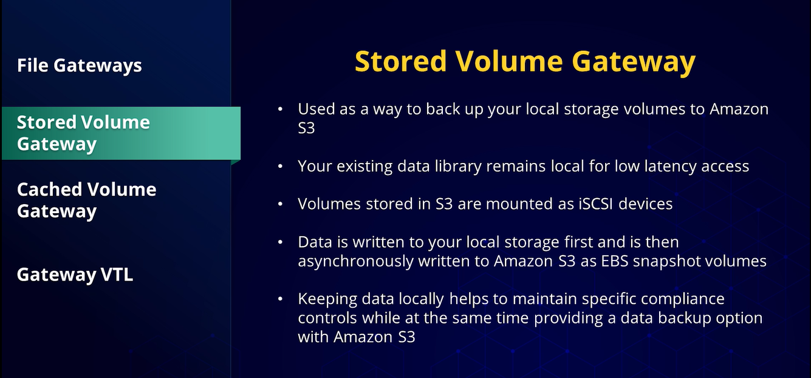
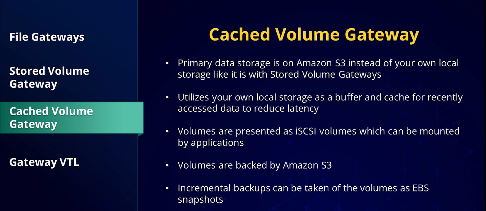

# 🛡️ AWS 7 Rs Migration Strategy Overview  

## 🧩 Definition
The **7 Rs framework** is a guide used by organizations transitioning from **on-premises infrastructure** to the **public cloud**, such as **AWS**.  

It helps organizations evaluate the most suitable **cloud migration strategy** based on their business requirements, regardless of the size or scale of the migration.  

---

## 🧠 Analogy: The 7 Rs as Moving to a New House  

Imagine you are **moving to a new house**. The **7 Rs** are like different strategies you might use for moving your belongings:

- 📦 **Rehosting**  
  - You pack everything as it is and move it straight to the new house.
  - No changes are made—just a direct move.

- 🔧 **Replatforming**  
  - You move your belongings but upgrade some items.
  - For example, replacing old shelves with new ones that fit better in the new house.

- 🛒 **Repurchasing**  
  - Instead of moving an old item, you buy a new one that works better in the new home.
  - Similar to replacing an existing application with a cloud-based solution.

- 🏗️ **Refactoring / Re-architecting**  
  - You redesign your furniture or remodel it so it works perfectly in the new house.
  - This allows you to take full advantage of the new space.

- 📍 **Relocating**  
  - You move your entire setup, like a modular room, into a similar space in the new house.
  - Only minimal changes are required.

- 🗑️ **Retiring**  
  - You throw away things you no longer need.
  - This prevents clutter in your new home.

- 🏠 **Retaining**  
  - You leave some belongings in your old house because they work better there or you are not ready to move them yet.

Each **R** helps organizations decide the best way to move their **applications and data** to the cloud, just like planning the best way to move belongings to a new home.

---

## ⚙️ Cloud Migration Considerations  

Migration involves evaluating all components involved in moving to the cloud, including:

- 👥 Customer data.
- 📡 Communication.
- 🔐 Security.
- 🛠️ Application management.

The **7 Rs framework** provides a structured approach to address different migration requirements effectively.

---

# 🏗️ The 7 Rs Migration Strategies  

## 1. 🔄 Rehosting (Lift and Shift)  

**Rehosting** involves moving existing **on-premises infrastructure to the cloud with minimal changes**.

### Key Characteristics:
- 🚀 Provides a quick migration path for legacy applications.
- 🛠️ Requires minimal application modifications.
- 💰 Reduces disruption (risk of failure) and development costs.

### Considerations:
- ⚠️ May not fully utilize cloud capabilities.
- ⚠️ May not be suitable for all workloads.

---

## 2. ⚙️ Replatforming  

**Replatforming** involves making slight modifications to applications to take advantage of cloud services.

### Key Characteristics:
- ☁️ Uses AWS managed services.
- 🔄 Improves automation and scalability.
- 💰 Helps optimize costs.
- 📈 Enhances growth potential.

### Considerations:
- 🛠️ Requires some application changes.
- 🚫 Does not involve a complete architectural redesign.

---

## 3. 🛒 Repurchasing  

**Repurchasing** involves replacing existing applications with cloud-based versions.

### Key Characteristics:
- 🛍️ Applications are purchased from sources such as the **AWS Marketplace**.
- 🔄 Avoids migrating applications that are not cloud-compatible.
- ✨ Provides updated features and maintenance.

### Considerations:
- 🔁 Replaces existing solutions instead of moving them directly.

---

## 4. 🏗️ Rearchitecting  

**Rearchitecting** involves redesigning applications to fully utilize cloud capabilities.

### Key Characteristics:
- ☁️ Takes advantage of cloud scalability and performance.
- 📈 Provides long-term cloud benefits.
- 🧩 Often involves adopting:
  - Microservices architectures.
  - Serverless architectures.

### Considerations:
- ⏳ Requires significant effort.
- 💰 Requires higher cost and development investment.

---

## 5. 📍 Relocating  

**Relocating** is similar to rehosting but is specifically associated with **VMware environments**.

### Key Characteristics:
- 🖥️ Moves workloads to **VMware Cloud on AWS**.
- 🔗 Allows integration with AWS services.
- 🛠️ Requires minimal changes to application logic.

---

## 6. 🗑️ Retiring  

**Retiring** involves identifying applications that are no longer needed and shutting them down.

### Key Characteristics:
- 🗑️ Removes outdated or redundant applications.
- 💰 Saves resources and reduces unnecessary costs.
- 🏗️ Helps simplify cloud architecture.

---

## 7. 🔒 Retaining  

**Retaining** involves keeping applications in their existing environment instead of migrating them.

### Key Characteristics:
- 🏢 Some applications may remain on-premises.
- ⏳ Common during early stages of cloud migration.
- 📈 Organizations can migrate additional workloads as cloud expertise grows.

---

## ⚖️ Key Benefits  
- ☁️ Provides a structured approach for cloud migration planning.  
- 🛠️ Helps organizations choose the appropriate migration strategy.  
- 📊 Supports migration decisions based on business requirements.  
- 🔐 Ensures important considerations such as data, security, and application management are evaluated.  
- 🚀 Helps organizations transition from on-premises infrastructure to AWS effectively.

---

# 🛡️ AWS 3-Stage Migration Process Overview  

## 🧩 Definition
AWS migration from **on-premises data centers** is managed through a structured **3-stage approach**:

1. 🔎 **Assess**
2. 🚀 **Mobilize**
3. ☁️ **Migrate and Modernize**

This approach helps organizations evaluate their current environment, create a migration strategy, and successfully move applications and data to AWS.

---

## 🧠 Analogy: AWS Migration as Moving to a New House  

Imagine you are **moving your family from one house to another**. The 3-stage migration approach is like planning and executing this move:

### 🔎 Assess (Planning the Move)
- 🏠 First, you walk through your current house and make a list of everything you own.
- 📋 You decide what you want to:
  - 📦 Take with you.
  - 💰 Sell.
  - 🗑️ Throw away.
- 🏡 You check if your new house is ready and determine what needs to be prepared.
- 🎯 This helps you understand the scope of the move and set clear goals.

Similar to AWS migration, the **Assess Stage** focuses on understanding the current IT environment and determining migration readiness.

---

### 🚀 Mobilize (Packing and Organizing)
- 📦 You gather packing materials and organize your belongings.
- 🛠️ You decide the best way to move each item:
  - 🧸 Some items require special care.
  - 📦 Others can be packed and moved easily.
- 👥 You may hire movers or ask others for help.
- 📋 Everyone understands their role in the moving process.

Similar to AWS migration, the **Mobilize Stage** focuses on creating a detailed migration plan, addressing requirements, and preparing resources.

---

### ☁️ Migrate and Modernize (Moving and Settling In)
- 🚚 You transport your belongings to the new house.
- 📦 You unpack and organize everything.
- 🛠️ You make sure everything works properly in the new environment.
- ✨ You may upgrade some items to better fit your new home.

Similar to AWS migration, the **Migrate and Modernize Stage** focuses on moving applications to AWS and improving them using AWS services.

---

# 🔎 1. Assess Stage  

## 🧩 Purpose
The **Assess Stage** focuses on understanding the current IT environment to determine readiness for AWS migration.

It helps organizations:

- 📊 Evaluate the existing infrastructure.
- 🎯 Set migration goals.
- 💼 Create a business case for migration.

---

## 🛠️ Key Services  

### 📈 AWS Migration Evaluator
- Helps assess the current environment.
- Provides insights for migration planning.
- Project cost using cost modeling and data analysis.
- Focusing on compute, storage, and Microsoft licenses to optimize costs.
- It uses an agentless collector tool for data gathering, providing Quick Insights documents with recommendations and cost projections after migration.

### 🗺️ AWS Migration Hub
- Serves as a central dashboard for planning, tracking, and managing migration projects, integrating with other AWS services to discover and audit server inventories.
- A powerful tool to help manage large migrations across multiple locations with multiple services.
- Collects data from various sources, including Migration Evaluator, AWS Agentless Discovery Connector, and AWS Application Discovery Agent, to provide detailed analysis and manage migrations effectively.

---

# 🚀 2. Mobilize Stage  

## 🧩 Purpose
The **Mobilize Stage** focuses on creating a detailed migration plan and preparing the organization for migration.

It involves:

- 📋 Defining migration strategies.
- 🔍 Addressing requirements.
- 🧠 Identifying skill gaps.
- 🛠️ Preparing resources needed for migration.

---

## 🏗️ Migration Strategies  

The Mobilize stage includes seven migration strategies:

1. 📍 **Relocate**
2. 🔄 **Rehost**
3. ⚙️ **Replatform**
4. 🏗️ **Refactor**
5. 🛒 **Repurchase**
6. 🗑️ **Retire**
7. 🔒 **Retain**

---

## 🛠️ Key Services  

### 🔎 AWS Application Discovery Service

The **AWS Application Discovery Service** helps organizations gather detailed information about existing workloads before migration.

### Key Features
- 📊 Collects workload information such as:
  - Usage data.
  - Configuration data.
  - Workload behavior.

- 🔐 Encrypts collected data for secure analysis.

- 🔄 Collected data can be used with other AWS services, including:
  - 🗺️ AWS Migration Hub.
  - 📊 Amazon Athena.
  - 📈 Amazon QuickSight.

---

### 📥 Discovery Methods

#### 🤖 Agent-based Discovery
- Installs an agent on:
  - 🐧 Linux servers.
  - 🪟 Windows servers.
  - 🖥️ Physical servers.
  - ☁️ Virtual servers.
- Captures:
  - ⚙️ Configuration data.
  - 📈 Performance data.
  - 🌐 Network data.

#### 🖥️ Agentless Discovery
- Uses a **Discovery Connector** for **VMware virtual machines**.
- Collects:
  - ⚙️ Configuration information.
  - 📊 Resource utilization data.

---

### 🏢 AWS Control Tower

**AWS Control Tower** helps organizations deploy a **multi-account AWS environment** while maintaining governance and security.

### Key Features
- 🏗️ Provides a structured setup for AWS accounts and teams.
- 🌍 Creates a **Landing Zone**, a preconfigured multi-account architecture based on security and compliance best practices.

---

### 🏛️ Landing Zone Organizational Units

The Landing Zone contains three organizational units:

#### 🌳 Root OU
- Serves as the top-level organizational unit.

#### 📚 Core OU
Contains shared accounts for:
- 🗂️ Log archiving.
    - Where all the logs will be sent between accounts.
- 🔍 Auditing.
    - Restricted account created to give your security and compliance team members read/write access to any account within your AWS landing zone.

These shared accounts provide **programmatic access** for security teams.

#### 💼 Custom OU
- Contains working accounts used by applications and teams.

#### SSO (Signle Sign On)
- Contains the AWS SSO users, and can also be used to define the scope or permissions available for each of those users.

---

### 🔐 Identity Management

AWS Control Tower provides:

- 👤 Single Sign-On (SSO) through **IAM Identity Center**.
- 🔗 Federated access.
- 🏢 Integration with Active Directory services.

---

### ⚠️ Important Consideration

- 🚨 Exercise caution when modifying **pre-configured Control Tower resources**.
- 🛡️ Incorrect changes may disrupt the Control Tower environment.

---

# ☁️ 3. Migrate and Modernize Stage  

## 🧩 Purpose
The **Migrate and Modernize Stage** focuses on moving applications, databases, and data to AWS while modernizing workloads where appropriate.

This stage is divided into two primary areas:

- 🖥️ Migrating servers, databases, and applications.
- 📦 Migrating data from data centers to AWS.

---

## 🖥️ AWS Application Migration Service (MGN)

The **AWS Application Migration Service** helps migrate applications to AWS with **minimal downtime** using a **lift-and-shift** approach.

### Key Features
- 🚀 Supports lift-and-shift application migrations.
- 🖥️ Migrates both:
  - Physical machines.
  - Virtual machines.
- ☁️ Converts existing infrastructure to AWS infrastructure.
- ⏱️ Minimizes application downtime during migration.

---

### 🔄 Migration Process

The migration process includes:

1. ⚙️ Configure replication settings template.
    - Helps to configure how data replication will be managed from each source server.
2. 📥 Install the **AWS Replication Agent**.
3. 🧪 Test the migrated application.
4. 🚀 Perform the final cutover to the production environment.

---

## 🗄️ AWS Database Migration Service (DMS)

The **AWS Database Migration Service (DMS)** helps migrate databases to AWS.

### Supported Database Types

AWS DMS supports migrating:

- 🗄️ Relational databases.
- ⚡ NoSQL databases.
- 📊 Data warehouses.

### Migration Flexibility

AWS DMS supports migrations between:

- 🔄 The same database engine.
- 🔀 Different database engines.

---

## 🔧 AWS Schema Conversion Tool (SCT)

The **AWS Schema Conversion Tool (SCT)** is used when the **source and target databases use different database engines**.

### Key Feature
- 🔄 Transforms database schemas so they are compatible with the target database.

---

## 📚 AWS Service Catalog

**AWS Service Catalog** simplifies the provisioning of approved IT resources within an organization.

### Key Features
- 📦 Allows users to select **pre-approved services**.
- 🛡️ Helps enforce security and AWS best practices.
- ⚙️ Simplifies deployment of approved resources.

---

### 🛒 Service Catalog Products

Products within the Service Catalog can include:

- ☁️ A single AWS resource.
- 🏗️ Complex multi-tier applications.

Products are organized into **portfolios**, which provide:

- 🔐 Security controls.
- ⚙️ Deployment constraints.
- 🛡️ Governance over approved resources.

---

## ⚖️ Key Benefits  
- 🔎 Provides a structured migration approach from on-premises to AWS.  
- 📊 Helps organizations understand their current environment before migration.  
- 🛠️ Creates a clear migration strategy and identifies preparation needs.  
- ☁️ Enables successful application and data migration to AWS.  
- 🚀 Supports modernization by selecting AWS services based on migration requirements.

---

## 📦 AWS DataSync

**AWS DataSync** is a service that provides **secure and efficient data transfer** between on-premises environments and AWS storage services, as well as between AWS storage services.

### Supported Storage

AWS DataSync supports data stored on:

- 🗂️ Network File Systems (NFS).
- 📁 Server Message Block (SMB) shares.
- 🪣 Self-managed object storage.
- ☁️ Amazon S3.
- 📂 Amazon Elastic File System (EFS).
- 💾 Amazon FSx for Windows File Server.
- 📦 AWS Snowcone.

---

### ⚙️ Key Features

- 🌐 Uses **AWS VPC Endpoints** for high bandwidth and low latency.
- ⚡ Uses a purpose-built data transfer protocol.
- 🧵 Uses a parallel, multithreaded architecture.
- 🚀 Supports transfer speeds of up to **10 Gbps**.
- 🔄 Automates secure data transfers.

---

### 🔐 Security Features

AWS DataSync provides:

- 🔒 Encryption in transit using **TLS (Transport Layer Security)**.
- 🛡️ Encryption at rest for AWS services.
    - For EFS and FSx for Windows
- ✅ Data validation to maintain data integrity during transfer.

---

## 📂 AWS Transfer Family

The **AWS Transfer Family** is a fully managed service for securely transferring files into and out of AWS storage services.

### Supported Protocols

AWS Transfer Family supports:

- 🔐 SFTP (Secure Shell File Transfer Protocol)
- 🔒 FTPS (File Transfer Protocol Secure)
- 📁 FTP (File Transfer protocol)
- 📨 AS2 (Applicability Statement 2)

---

### Supported Storage

Files can be transferred to and from:

- 🪣 Amazon S3.
- 📂 Amazon Elastic File System (EFS).

---

### Key Features

- ☁️ Fully managed service.
- 🌍 Operates across multiple Availability Zones.
- 📈 Supports automatic scaling.
- 🛠️ Eliminates the need to provision and manage transfer servers.

---

### 📋 Managed File Transfer Workflow (MFTW)

The **Managed File Transfer Workflow** helps automate and manage file transfers.

It supports pre-transfer processing actions such as:

- 🏷️ Tagging files.
- 🔒 Encrypting files.

---

### ⚙️ AWS Transfer Family Setup

To use AWS Transfer Family:

1. 🪣 Configure the destination storage.
2. 🔐 Assign IAM roles and permissions.
3. 🖥️ Set up a Transfer Family Server.
4. 👥 Add users for access.

---

### 💻 Supported Clients

Transfers can be performed using clients such as:

- 🐧 OpenSSH
- 📂 WinSCP
- 🦆 Cyberduck
- 📁 FileZilla

Optional:

- 📊 CloudWatch logging can be enabled for monitoring.

---

# 🛡️ AWS Snow Family & Storage Gateway Overview  

## 🧩 Definition
The **AWS Snow Family** consists of **physical hardware devices** designed to transfer large amounts of data **to and from AWS**, making them ideal when **network connectivity is slow, unreliable, or impractical**.

**AWS Storage Gateway** acts as a **bridge between on-premises storage systems and AWS**, allowing organizations to seamlessly integrate local infrastructure with AWS storage services for backup, disaster recovery, and hybrid cloud storage.

---

## 🧠 Analogy: AWS Snow Family & Storage Gateway as a Moving Company and Storage Facility

Imagine you're relocating an entire warehouse of valuable inventory to another city.

- 🚚 The **AWS Snow Family** is like hiring specialized moving trucks of different sizes.
  - 🚐 A **Snowcone** is like a small delivery van for lighter loads.
  - 🚛 A **Snowball** is like a large moving truck for bigger shipments.
  - 🚂 A **Snowmobile** is like an entire freight convoy capable of moving enormous amounts of cargo.

- 🏗️ Some of these moving trucks even have **portable workstations**, allowing workers to process and organize inventory while traveling, similar to Snow devices that can run EC2 instances at the edge.

- 🏢 **AWS Storage Gateway** is like having a local storage warehouse connected directly to your new warehouse in another city.
  - 📁 You can quickly access frequently used items locally.
  - ☁️ Everything is safely synchronized and stored in the remote warehouse.
  - 📼 Older inventory can even be archived in long-term storage instead of occupying valuable local space.

This allows organizations to efficiently move, store, and access data regardless of network limitations.

---

# 🚚 AWS Snow Family

## 🧩 Purpose

The **AWS Snow Family** is designed for transferring **large volumes of data** between on-premises environments and AWS when traditional network transfers are impractical.

---

## 📦 Snow Family Devices

### 🚐 AWS Snowcone

- 📏 Smallest device in the Snow Family.
- 📦 Designed for smaller-scale data transfers.

---

### 🚛 AWS Snowball

- 📈 Larger device for transferring greater amounts of data.
- 🚚 Suitable for large-scale migration projects.

---

### 🚂 AWS Snowmobile

- 📦 Largest member of the Snow Family.
- 💾 Capable of transferring **up to 100 petabytes** of data.

---

## ⚙️ Compute Capabilities

Some Snow Family devices include built-in compute capabilities.

### Key Features

- 🖥️ Can run **Amazon EC2 instances**.
- 🌐 Allows data processing at the edge.
- 📡 Useful in remote locations without persistent network connectivity.

---

# 🗄️ AWS Storage Gateway

## 🧩 Purpose

**AWS Storage Gateway** provides a bridge between **on-premises storage systems** and **AWS storage services**.

It helps organizations integrate local infrastructure with AWS for:

- 💾 Data backup.
- 🛡️ Disaster recovery.
- ☁️ Hybrid cloud storage.

---

## 📂 File Gateway

The **File Gateway** stores files as **objects in Amazon S3**.

### Key Features

- 📁 Securely stores files in Amazon S3.
- ⚡ Uses local caching to:
  - Reduce latency.
  - Improve performance.
  - Reduce storage costs.

---

## 💽 Volume Gateway

The **Volume Gateway** provides block storage and supports two configurations.

### 🗃️ Stored Volume Gateway

- 💾 Keeps primary data stored locally.
- ⚡ Provides low-latency access.
- ☁️ Copies data to AWS for backup.

---

### ☁️ Cached Volume Gateway

- 🪣 Uses **Amazon S3** as the primary storage location.
- ⚡ Stores frequently accessed data locally using a cache.
- 💰 Reduces on-premises storage requirements.

---

## 📼 Tape Gateway (Gateway VTL)

The **Tape Gateway**, also known as **Gateway VTL (Virtual Tape Library)**, provides a virtual replacement for traditional tape backup systems.

### Key Features

- 💾 Backs up data to Amazon S3.
- 🧊 Archives data in Amazon Glacier.
- 📼 Replaces physical tape components with virtual tapes.
- 🔒 Improves security and durability compared to physical tape storage.

---

## ⚖️ Key Benefits

- 🚚 Transfers large amounts of data when network connectivity is limited.
- 📦 Offers multiple Snow Family devices for different migration sizes.
- 🖥️ Some Snow devices provide edge computing with Amazon EC2.
- ☁️ AWS Storage Gateway integrates on-premises storage with AWS.
- 📁 File Gateway stores files as Amazon S3 objects with local caching.
- 💽 Volume Gateway supports both local-first and cloud-first storage models.
- 📼 Tape Gateway modernizes tape backups using Amazon S3 and Amazon Glacier.