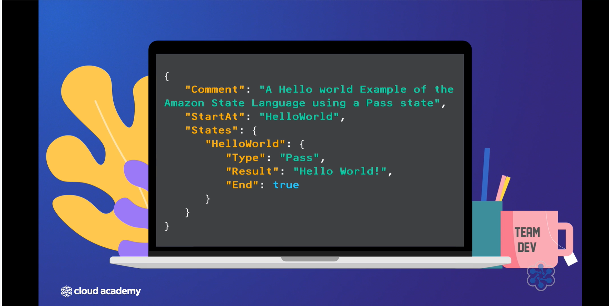

# 📌 AWS Step Functions

## 🧠 Overview
- ⚡ **AWS Lambda** is popular for serverless computing  
- ⏱️ Lambda has a **15-minute execution time limit**  
- ⚠️ This limitation can be restrictive for complex tasks  
- 🔄 **AWS Step Functions** complement Lambda by enabling more complex workflows  

---

## 🏗️ What AWS Step Functions Provide
- ⚙️ A **state machine service**, such as AWS Step Functions, is a **serverless orchestration service**
- 🧩 Allows you to define workflows as a **series of states**
- 🔄 Each state represents a step in the workflow

---

## 🏗️ How It Works

- 📄 The workflow is defined in a **JSON-based structured language**
- 📝 This language is called **Amazon State Language**
- 🔀 It specifies:
  - The sequence of states  
  - The transitions between states  

The service reads this definition and executes the workflow accordingly.

---

## 🔧 Workflow Capabilities

State machines can handle complex operations by:

- 🔁 Running tasks in sequence  
- 🔀 Running tasks in parallel  
- 🔄 Retrying tasks until successful  
- 🤔 Making decisions based on input variables  

---

## 👀 Visual Workflow Representation
- 🖥️ Provides a **visual representation** of workflows  
- 🛠️ Helps with creating state machines  
- 🐞 Assists in debugging workflow logic  

---

## 🧩 State Types in AWS Step Functions

### ⚙️ Task State
- 🛠️ Where the **actual work is performed**
- 🔗 You define a resource (such as a **Lambda function**) to execute
- ⏱️ Includes a specified timeout period
- 🧩 Often used as a sub-state within other states  

---

### 🔀 Choice State
- 🤔 Functions like an **if-then operation**
- 📥 Evaluates input
- ➡️ Chooses the correct output path based on given conditions
- 🧠 Enables additional application logic  

---

### ⏳ Wait State
- ⏸️ Pauses the state machine
- 🕒 Can wait until:
  - A specific time  
  - A certain duration  
- 📅 Useful for scheduling tasks (e.g., sending emails at a specific time)  

---

### ✅ Succeed State
- 🎉 Marks **successful termination** of the state machine
- 🧩 Often used within a Choice state to conclude the process  

---

### ❌ Fail State
- 🚫 Indicates a **failed termination**
- 📝 Requires:
  - An error message  
  - A cause  

---

### 🔄 Parallel State
- 🚀 Executes multiple states **concurrently**
- ⏳ Waits for all branches to complete
- 📦 Combines results into an **array-like format**
- ➡️ Passes combined results to the next state  

---

### 🗺️ Map State
- 🔁 Iterates over a list of items
- 🔄 Similar to a **for loop**
- ⚙️ Performs tasks on each item
- 🎛️ Allows control over the number of concurrent items processed  

---

### ➡️ Pass State
- 🧪 Used for debugging or initial setup
- 🔄 Passes input directly to output
- ➕ Can add a fixed result  

---

## 🔗 Direct AWS Service Integrations
- 🔌 Can interact directly with AWS services  
- 🚫 Does not require Lambda for these integrations  

Supported services mentioned:
- 🗄️ **DynamoDB**  
- 🐳 **ECS**  
- 📦 **Fargate**  
- 📢 **SNS**  
- 📬 **SQS**  
- 🔬 **Glue**  
- 🤖 **SageMaker**  

---

## 🔄 Advanced Workflow Features
- 📩 Supports **asynchronous callbacks** 
- 🧱 Allows **nesting of state machines**  
- ♻️ Enhances flexibility and reusability  

---

## 📩 Asynchronous Callbacks in AWS Step Functions

- 🔄 AWS Step Functions support **asynchronous callbacks**
- ⏸️ Allow workflows to **wait for external processes or approvals** before proceeding
- 🧩 Enhance workflow flexibility and resilience  

---

## 🌐 When They’re Useful

- ✅ Workflows requiring **external validation**
- 🔗 Interaction with **third-party APIs**
- ⏳ Scenarios where processes may take extended periods to complete
- 🚫 Situations where immediate responses are not feasible  

---

## 🔁 How They Improve Workflows

- ⏸️ Enable workflows to **pause**
- ▶️ Resume execution based on external events  
- 🌱 Add dynamism and robustness to the process  
- 🧠 Support more complex and interactive workflows  

---

# 🧠 Analogy: AWS Step Functions

## 🎼 Step Functions = Orchestra Conductor

- 🎶 Imagine AWS Step Functions as the **conductor of an orchestra**
- 🎻 Each musician represents a service (like a Lambda function or another AWS service)
- 🎵 Each musician knows how to play their instrument
- 🧭 The conductor tells them when to:
  - ▶️ Start  
  - ⏸️ Stop  
  - 🎶 Play together  

---

## 📖 The Musical Score = The Workflow

- 📄 The conductor follows a **musical score** (the workflow)
- 🔢 Guides musicians through their parts in the correct order
- 🔁 Sometimes sections play:
  - In sequence  
  - In parallel  
  - Repeated if needed  

---

## 🔄 How This Relates to Step Functions

- 🧩 Step Functions coordinate different tasks  
- ⏱️ Ensure each step happens at the right time  
- 🔢 Maintain the correct order  
- 🤔 Apply the correct logic  
- 🎯 Just like a conductor ensures a harmonious performance 