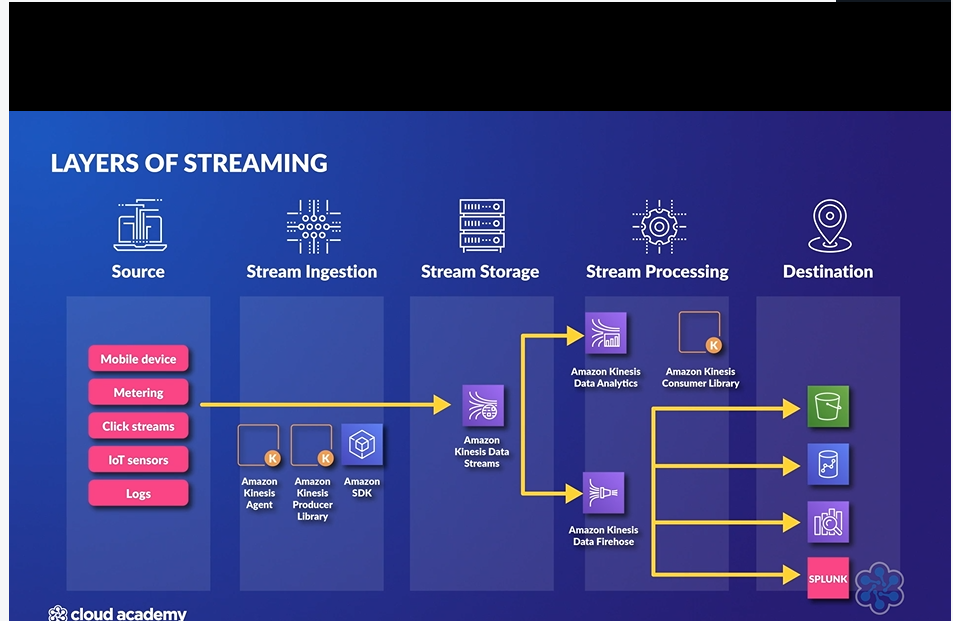
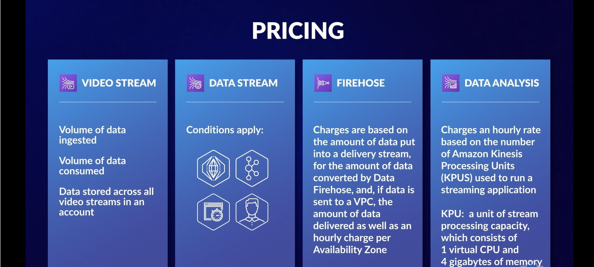

# 🛡️ Amazon Kinesis Data Streams Overview  

## 🧩 Definition  

**Amazon Kinesis Data Streams** is a real-time data streaming service designed to collect, process, and analyze large volumes of streaming data with low latency.

It enables applications to continuously receive and process data as it is generated, making it ideal for workloads where immediate insights and actions are required.

Examples include:
- 📈 Stock market trading systems.
- 🌐 Website clickstream analysis.
- 📡 IoT device data processing.
- 💰 Financial transaction monitoring.

---

## ⚡ Real-Time Data Processing  

**Real-time processing** involves collecting and analyzing data quickly enough that the results remain useful for immediate decision-making.

This is critical for systems where delays can impact outcomes:

- 📈 **Stock Market Trading**
  - Requires immediate processing of price changes and market activity.

- 📡 **IoT Devices**
  - Requires rapid processing of sensor data for monitoring and automated responses.

---

## ⚠️ Challenges with Traditional Messaging Systems  

Traditional messaging systems such as **queues and topics** can struggle with:

- 📦 High-volume data transfers.
- ⚡ Continuous streams of incoming data.
- ⏱️ Low-latency processing requirements.

Because of these limitations, systems requiring real-time processing need specialized streaming services like **Amazon Kinesis Data Streams**.

---

## ⚙️ Features and Use Cases  

- 🚀 Handles **gigabytes of data per second** from multiple sources.

- 📥 Collects streaming data from:
  - Website clickstreams.
  - Financial transactions.
  - IoT devices.

- 📊 Enables real-time applications such as:
  - Live analytics.
  - Real-time dashboards.
  - Anomaly detection.
  - Dynamic pricing systems.
  - On-Demand or Provisioned throughput.

- 🔄 Maintains received data in the exact order it was received.

- 📚 Allows multiple consumer applications to:
  - Read records.
  - Replay historical data.
  - Process the same stream independently.

- 🧩 Can automatically encrypt Data.

---

## 🕒 Data Retention  

Kinesis Data Streams stores incoming data records for a configurable retention period.

Default retention:

- ⏱️ **24 hours**

Extended retention:

- 📆 Up to **365 days**

Benefits:

- 🔄 Consumers can replay records.
- 📊 Large datasets can be analyzed after initial processing.
- 🧩 Multiple applications can process the same streaming data.

---

## 🧩 Kinesis Data Stream Architecture Components  

### 1. 📤 Producers  

Producers are applications or systems that send data into a Kinesis Data Stream.

Examples:
- Websites generating clickstream data.
- Financial systems producing transactions.
- IoT devices sending sensor information.

---
### 2. 🌊 Kinesis Data Stream  

The **Kinesis Data Stream** is the core service responsible for **ingesting and storing streaming data**.

It acts as the central pipeline between producers generating data and consumers processing that data.

Features:

- 📥 Receives streaming data from producers.
- 🧱 Consists of one or more **shards**.
- ⚡ Each shard is capable of handling a specific amount of data throughput.
- 📦 Stores incoming data records in the order they are received.

Each data record written to the Kinesis Data Stream contains:

- 🔑 **Partition Key**
  - Used to group data in a shard in a stream.
  - Defines the shard the record belongs to.

- 🔢 **Sequence Number**
  - A unique identifier assigned to each record.
  - Maintains the order of records within a shard.

- 📄 **Data Payload**
  - The actual data being streamed.
   - Maximum size:
    - **1 MB per record**

---

### 3. 🧱 Shards  

A **shard** is the basic storage unit of a Kinesis Data Stream.

Each shard:

- Can handle up to **1,000 records per second** or **1 megabyte per second for writes**, and up to **2 megabytes per second for reads**.
- Data records are assigned to shards **based on their partition key**, ensuring that each record goes into only **one** shard.
- Shards store records in order, and each has a unique Shard ID and a non-overlapping hash key range.
- Maintains the order of received records.
- Allows consumers to process records in the correct order.
- Merging and spliting shards allow to increase and decrease the number of shards as needed in a stream.

---

### 5. 📥 Consumers  

Consumers are applications that process data from Kinesis Data Streams.

Consumers use the:

**Kinesis Client Library (KCL)**

The KCL provides:

- ⚖️ Load balancing between consumers.
- 🛡️ Fault-tolerant record processing.
- 🔄 Decoupled data consumption.

---

## 🧠 Analogy: Kinesis Data Streams as a High-Speed Post Office Conveyor Belt  

Imagine a **busy post office sorting center**.

- 📬 In traditional mail delivery:
  - Letters are collected in batches.
  - Mail is sorted later.
  - Deliveries happen at scheduled times.
  
- ⏳ This is similar to traditional messaging systems where:
  - Data is processed in groups.
  - Information may experience delays before being delivered or processed.

---

Now imagine the post office introduces a **high-speed conveyor belt**:

- ⚡ As soon as a letter arrives:
  - It is immediately placed on the conveyor belt.
  - It is quickly moved toward its destination.
  - Workers can process it almost instantly.

- 🚀 This represents **real-time data streaming**, where:
  - Data is processed as soon as it is generated.
  - Applications can immediately respond to incoming information.

---

Similarly, **Amazon Kinesis Data Streams works like this high-speed conveyor belt**:

- 📥 Collects data from many sources:
  - Websites.
  - Financial systems.
  - IoT devices.

- 🔢 Keeps incoming data records in order.

- 👥 Allows multiple workers (consumer applications) to read and process the data.

- ⚡ Enables immediate actions based on real-time information, such as:
  - 🚨 Security alerts.
  - 📈 Stock price updates.
  - 📊 Real-time analytics.

Kinesis Data Streams ensures important data reaches the right applications quickly, allowing organizations to make decisions without waiting for batch processing.

---

# 🛡️ Amazon Kinesis Data Firehose Overview  

## 🧩 Definition  

**Amazon Kinesis Data Firehose** is a fully managed service that collects, transforms, and loads large amounts of streaming data into various destinations.

It simplifies the process of delivering streaming data by automatically handling the required infrastructure, storage, networking, and configuration.

Supported destinations include:

- 🪣 Amazon S3
- 🗄️ Amazon DynamoDB
- 📊 Amazon Redshift
- Amazon EMR
- Other supported data destinations

---

## 🏗️ Kinesis Data Firehose Architecture  

Kinesis Data Firehose architecture is designed for **simplicity, automation, and fully managed data delivery**.

Unlike **Kinesis Data Streams**, Firehose does **not use shards**. Instead, it automatically manages infrastructure, scaling, and configuration without requiring custom consumer applications.

---

## 🔄 Data Flow  

1. 📤 **Data Producers**
   - Data producers send streaming data to the Firehose delivery stream.
   - Examples:
     - Applications.
     - Servers.
     - Kinesis Agent.

2. 🚚 **Kinesis Data Firehose Delivery Stream**
   - Firehose receives incoming streaming data.
   - Automatically manages:
     - Infrastructure.
     - Scaling.
     - Configuration.

3. 📦 **Data Buffering**
   - Firehose temporarily stores incoming data.
   - Data is buffered until:
     - A specified buffer size is reached.
     - A specified time interval is reached.

4. ⚙️ **Data Processing**
   - Before delivery, Firehose can:
     - 🔄 Transform data.
     - 🗜️ Compress data.
     - 🔐 Encrypt data.

5. 📥 **Destination Delivery**
   - Firehose delivers processed data to configured destinations.

---

## ⚙️ Features and Use Cases  

- 📥 **Collects Streaming Data**
  - Receives large datasets from different sources.
  - Delivers data continuously to configured destinations.

- 🔄 **Transforms Data**
  - Can process and transform data before loading it into the destination.

- 📤 **Loads Data Automatically**
  - Sends processed data to services such as:
    - Amazon S3.
    - Amazon DynamoDB.
    - Amazon Redshift.

- 🛠️ **Fully Managed Service**
  - AWS manages:
    - Infrastructure.
    - Storage.
    - Networking.
    - Configuration.

  - Users do not need to manage hardware or software.

---

## 🏗️ Automatic Scaling and Replication  

Kinesis Data Firehose automatically:

- 📈 Scales based on data volume.
- 🔁 Replicates data across **three facilities within an AWS Region**.

This provides reliability and availability without requiring manual infrastructure management.

---

## ⏳ Data Buffering  

Kinesis Data Firehose does not immediately send every individual record to the destination.

Instead, it uses buffering:

- 📦 Data is collected until it reaches:
  - A predefined buffer size.
  - A predefined time interval.
    - 60 to 900 seconds.

- Buffer Size:
    - S3 - 1MB to 128MB
    - OpenSearch - 1MB to 100MB
    - Lambda Functions - 0.2MB up to 3MB

- 🚚 Once the buffer conditions are met:
  - Firehose delivers the collected data to the destination.

Buffer sizes and intervals vary depending on the destination service.

---

## 🕒 Destination Availability Handling  

If a destination becomes unavailable:

- 💾 Kinesis Firehose stores data for up to **24 hours**.
- 🔄 After the destination becomes available, Firehose continues delivery.

Exception:

- When the source is a **Kinesis Data Stream**, data handling behavior differs.

---

## 🔄 Amazon Redshift Integration  

When delivering data to **Amazon Redshift**:

1. 📥 Data is first loaded into **Amazon S3**.
    - No Shards are needed.
    - Optionally back up transformed data to another S3 bucket.
2. 🚚 Firehose then transfers the data from S3.
3. 📊 Data is loaded into the Redshift cluster.

---

## 🔒 Data Compression and Encryption  

Kinesis Data Firehose supports:

- 🗜️ **Data Compression**
  - Reduces storage requirements.

- 🔐 **Data Encryption**
  - Protects data during delivery.

- 🪣 **Optional S3 Backup**
  - Transformed data can optionally be backed up to another Amazon S3 bucket.

---

## ⚡ Performance and Pricing  

### ⏱️ Latency

- Kinesis Data Firehose operates with latency of:
  - **60 seconds or more**

This makes it suitable for data delivery and loading workloads rather than ultra-low-latency processing.

---

### 💰 Pricing

- Charges are based on:
  - The amount of data processed.

---

## 🖥️ Kinesis Agent  

The **Kinesis Agent** is a Java application used to collect and send data to a Firehose delivery stream.

Features:

- ☕ Written as a Java application.
- 🖥️ Can be installed on different operating systems.
- 📤 Collects data and sends it to Kinesis Data Firehose.

---

## 🧠 Analogy: Kinesis Data Firehose as an Automated Delivery Service  

Imagine **Kinesis Data Firehose as a highly efficient package delivery service**.

- 📦 Instead of delivering every package immediately as soon as it arrives:
  - The delivery service collects packages from multiple senders.
  - Temporarily stores them in a warehouse.
  - Delivers packages in batches to different destinations.

- 🏭 The warehouse represents the **Firehose buffer**:
  - Packages (data) are stored temporarily.
  - Delivery happens when:
    - 📏 The warehouse reaches a specified size.
    - ⏱️ A specific amount of time has passed.

---

The delivery service automatically handles everything behind the scenes:

- 🚚 Manages trucks, routes, and drivers.
- 📈 Scales delivery capacity when more packages arrive.
- 🔒 Ensures packages are delivered securely and reliably.

---

Similarly, **Amazon Kinesis Data Firehose**:

- 📥 Collects streaming data from multiple sources.
- 📦 Buffers data before delivery.
- 🚚 Delivers data in batches to destinations such as:
  - 🪣 Amazon S3.
  - 📊 Amazon Redshift.
  - 🔍 Amazon OpenSearch.

- 🛠️ Automatically manages:
  - Infrastructure.
  - Scaling.
  - Configuration.

Kinesis Data Firehose allows organizations to deliver streaming data with minimal operational effort while ensuring data reaches the correct destination efficiently and securely.

---

# 🛡️ Amazon Kinesis Data Analytics Overview  

## 🧩 Definition  

**Amazon Kinesis Data Analytics** is a fully managed service that enables **real-time data analysis** using SQL on streaming data from:

- 🌊 **Amazon Kinesis Data Streams**
- 🚚 **Amazon Kinesis Data Firehose**

It allows applications to continuously analyze incoming streaming data and generate real-time insights.

---

## ⚙️ Features and Use Cases  

- 📊 **Real-Time Data Analysis**
  - Uses SQL queries to analyze streaming data as it arrives.
  - Enables users to process and understand data immediately.

- 🔄 **Works with Kinesis Streaming Services**
  - Can analyze data from:
    - Kinesis Data Streams.
    - Kinesis Data Firehose.

- 📥 **Stores Processed Data**
  - Processed results can be stored in:
    - 🪣 Amazon S3.
    - 🔍 Amazon OpenSearch clusters.
    - 📊 Amazon Redshift clusters.

- ⚡ **Real-Time Query Processing**
  - Users can create applications that:
    - Read streaming data.
    - Process data using SQL.
    - Generate output streams from real-time queries.

---

## 🛠️ Kinesis Data Analytics Applications  

Users create **Kinesis Data Analytics applications** to process streaming data.

Workflow:

1. 📥 Application reads incoming streaming data.
2. 🧮 SQL queries analyze and process the data.
3. 📤 Results are sent to configured destinations or streaming services.

---

## 🧑‍💻 SQL Interactive Editor  

Kinesis Data Analytics provides an interactive SQL editor that allows users to:

- ✍️ Write SQL queries.
- 🧪 Test queries using live streaming data.
- 🔍 Validate data processing logic before deployment.

This allows developers to quickly build and test real-time streaming applications.

---

## 🚀 Kinesis Data Analytics Studio  

**Kinesis Data Analytics Studio** provides advanced analytical tools for building streaming applications quickly.

Features:

- ⚡ Helps create streaming applications faster.
- 📊 Provides tools for advanced data analysis.
- 🔄 Simplifies development of real-time analytics workflows.

---

## 🔄 Output Destinations  

Kinesis Data Analytics can send processed results to:

- 🚚 **Amazon Kinesis Data Firehose**
  - Delivers processed streaming data to destinations.

- ⚡ **AWS Lambda**
  - Executes functions based on processed streaming results.

- 🌊 **Amazon Kinesis Data Streams**
  - Sends results back into another streaming workflow.

---

## 🧠 Analogy: Kinesis Data Analytics as a Smart Traffic Control Center  

Imagine **Kinesis Data Analytics as a smart traffic control center for a busy city**.

- 🏙️ The city's roads represent **data streams**.
- 🚗 Thousands of cars traveling through the roads represent **data points** being generated every second.

In a traditional system, it would be difficult to monitor all roads and react quickly to changes.

---

The smart traffic control center (**Kinesis Data Analytics**) continuously monitors traffic in real time:

- 👀 Watches all roads as data flows through the system.
- 🧮 Uses advanced tools (**SQL queries**) to analyze traffic patterns.
- 🚨 Detects:
  - Traffic congestion.
  - Accidents.
  - Unusual patterns.

---

Based on what it observes, the control center can immediately take action:

- 📺 Update digital signs (**dashboards**) with current information.
- 🚨 Send alerts when problems are detected.
- 🔄 Reroute traffic by sending results to other services.

---

Similarly, **Amazon Kinesis Data Analytics**:

- 🌊 Monitors streaming data in real time.
- 🧮 Uses SQL queries to analyze incoming data.
- 📊 Identifies patterns and generates insights.
- 📤 Sends processed results to services such as:
  - Amazon S3.
  - Amazon Redshift.
  - Amazon OpenSearch.
  - AWS Lambda.
  - Kinesis Data Streams.

Like a modern traffic control center, Kinesis Data Analytics is:

- ⚡ Real-time.
- 🤖 Fully managed.
- 📈 Automatically scalable.
- 🛠️ Able to handle changing workloads without manual intervention.

It helps applications make quick decisions and keep data processing workflows running smoothly.

---

# 🛡️ Amazon Kinesis Overview  

## 🧩 Definition  

**Amazon Kinesis** is a streaming data platform designed to simplify and reduce the cost of collecting, processing, and analyzing streaming data in AWS.

It enables organizations to process data in:

- ⚡ **Real-time**
- ⏱️ **Near real-time**

Kinesis allows applications to collect large amounts of streaming data and perform analysis or actions as the data is generated.

---

## ⚙️ Amazon Kinesis Services  

Amazon Kinesis consists of four main services:

1. 🎥 **Kinesis Video Streams**
2. 🌊 **Kinesis Data Streams**
3. 🚚 **Kinesis Data Firehose**
4. 📊 **Kinesis Data Analytics**

Each service is designed for different streaming data requirements.

---

# 🎥 Amazon Kinesis Video Streams  

## 🧩 Definition  

**Kinesis Video Streams** is designed for streaming **binary-encoded data**, such as:

- 🎥 Video.
- 🔊 Audio.

It enables applications to securely stream media data in real time.

---

## ⚙️ Features  

- 📹 Handles media streaming workloads.
- 🔄 Supports real-time video streaming.
- 🌐 Supports **WebRTC** for real-time communication.

Use cases:

- Security cameras.
- Video monitoring.
- Real-time media applications.

---

# 🌊 Amazon Kinesis Data Streams  

## 🧩 Definition  

**Kinesis Data Streams** is a customizable streaming service designed for collecting and processing streaming data.

It is commonly used for:

- 📄 Text-encoded data.
- Real-time event processing.
- Custom streaming applications.

---

## ⚙️ Features  

- 🛠️ Provides APIs and SDKs for application development.
- 🔧 Allows developers to customize data processing workflows.
- 📈 Requires manual scaling (no autoscaling).
- Data records are immutable meaning they cannot be updated or deleted

Compared to Firehose:

- Kinesis Data Streams provides more control.
- Users are responsible for managing scaling and application processing.

---

# 🚚 Amazon Kinesis Data Firehose  

## 🧩 Definition  

**Kinesis Data Firehose** is a fully managed service for delivering streaming data to destinations.

It simplifies streaming data delivery by automatically managing infrastructure and scaling.

---

## ⚙️ Features  

- 🛠️ Fully managed service.
- 📈 Automatically scales based on data volume.
- 🔄 Transforms data formats before delivery.
- 📤 Delivers streaming data to supported destinations.
- It is considered and a near real time data stream.

Unlike Kinesis Data Streams:

- ❌ Does not require manual scaling.
- ❌ Does not require custom consumer applications.

---

# 📊 Amazon Kinesis Data Analytics  

## 🧩 Definition  

**Kinesis Data Analytics** enables real-time analysis of streaming data.

It allows users to process streaming data using:

- 🧮 SQL.
- ⚙️ Apache Flink.

---

## ⚙️ Features  

- ⚡ Performs real-time data analysis.
- 🔄 Supports ETL (Extract, Transform, Load) processes.
- 📈 Generates real-time metrics.

Use cases:

- Real-time dashboards.
- Streaming analytics.
- Event processing.

---

# 💰 Pricing Overview  

Amazon Kinesis pricing varies depending on the service.

Costs are based on:

- 📦 Data volume processed.
- 💾 Data storage.
- ⚙️ Processing capacity.

Pricing differs between Kinesis services depending on the resources used.

⚠️ Amazon Kinesis does **not provide a free tier**.

---

## ⚖️ Key Takeaways  

- 🌊 Amazon Kinesis simplifies streaming data collection, processing, and analysis in AWS.
- ⚡ Supports real-time and near real-time data workloads.
- 🎥 Kinesis Video Streams handles binary media data such as audio and video.
- 🌊 Kinesis Data Streams provides customizable real-time data processing with manual scaling.
- 🚚 Kinesis Data Firehose provides fully managed streaming data delivery with automatic scaling.
- 📊 Kinesis Data Analytics enables real-time analysis using SQL or Apache Flink.
- 💰 Pricing depends on data volume, storage, and processing requirements.
- ❌ Kinesis services do not include a free tier.