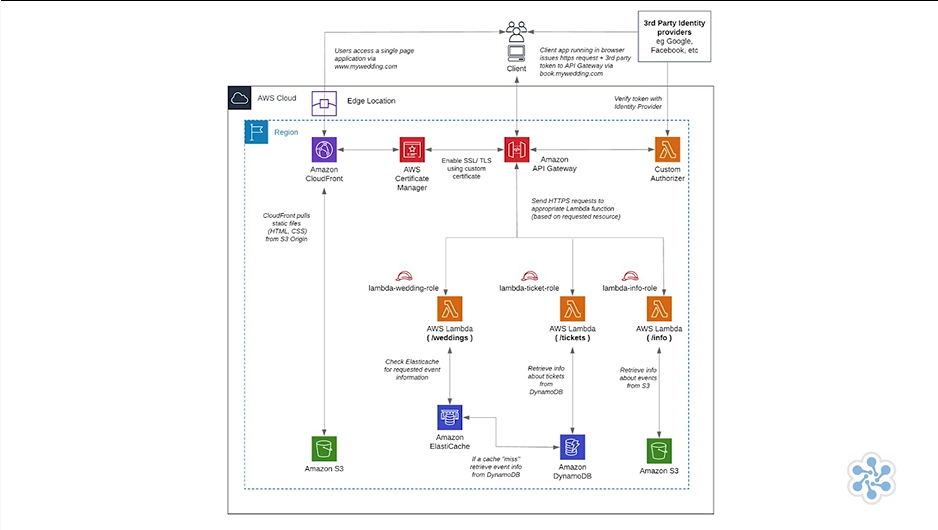

# 🛡️ Serverless Architecture Patterns Overview  

## 🧩 Definition
**Serverless architecture** uses managed computing services such as **AWS Lambda** and **Amazon API Gateway** instead of traditional server-based implementations.  

It eliminates the need to:
- 🖥️ Provision servers or instances.
- 📈 Manage auto-scaling.
- 🛠️ Install and maintain code interpreters.

AWS manages the underlying infrastructure, allowing developers to focus on application logic and functionality.

---

## 🧠 Analogy: Serverless Architecture as a Restaurant Kitchen  

Imagine running a restaurant where you do not own or manage the kitchen equipment.

- 🍳 Instead of buying ovens, maintaining appliances, and hiring maintenance staff, you use a fully managed kitchen that provides everything needed.
- 👨‍🍳 You only focus on preparing the recipe and serving customers.
- ⚡ The kitchen automatically provides more cooking stations when demand increases and reduces them when demand decreases.
- 🛠️ Similarly, **serverless architecture allows developers to focus on code while AWS manages servers, scaling, and infrastructure.**
- ☁️ **AWS Lambda** runs the application logic, while **Amazon API Gateway** manages communication between applications and services.

---

## ⚡ AWS Lambda and API Gateway  

### ⚡ AWS Lambda
**AWS Lambda** provides serverless compute by executing code without requiring server management.

Lambda eliminates the need to:
- 🖥️ Manage operating systems.
- 📏 Size instances.
- 📊 Monitor servers.
- 📈 Scale infrastructure manually.

Lambda functions:
- 🔄 Execute business logic.
- ⚡ Are triggered by events or API requests.
- 🔐 Assume **IAM roles** to interact with other AWS services.

---

### 🌐 Amazon API Gateway
**Amazon API Gateway** manages communication between:

- ⚡ Lambda functions.
- 🌐 Applications.
- ☁️ AWS services.

API Gateway simplifies:
- 🚀 API deployment.
- 📊 API monitoring.
- 🔐 API security.

It also provides:
- ⚡ Automatic scaling.
- 🛡️ Security management.
- 🚀 Improved API performance through caching and content delivery.

---

## 🏗️ Serverless Architecture Benefits  

### 🛠️ Reduced Infrastructure Management
Using serverless architecture removes the need to:

- 🖥️ Provision instances.
- 📈 Configure auto-scaling.
- 🛠️ Manage operating systems.
- 📊 Monitor infrastructure.

---

### 🔐 Security and Private Resource Access  
AWS Lambda can integrate with a **VPC** to securely access private resources.

Benefits include:

- 🔒 Databases remain inaccessible from the internet.
- 🗄️ Private storage resources remain protected.
- 🌐 Applications can securely interact with internal resources.

---

## 🏢 Serverless Architecture Layers  

### 🎨 Presentation Layer  

The presentation layer uses:

- 🗄️ **Amazon S3**
  - Stores static content.

- 🌎 **Amazon CloudFront**
  - Provides content delivery.

- 🔐 **AWS Certificate Manager**
  - Manages SSL certificates.

---

### ⚙️ Logic Layer  

The logic layer uses:

- ⚡ **AWS Lambda**
  - Executes application business logic.

- 🌐 **Amazon API Gateway**
  - Provides API endpoints and manages communication.

Each API is integrated with a **Lambda function** to process requests.

---

### 🗄️ Data Tier  

The data tier uses:

- 🗄️ **Amazon S3**
  - Stores static content.

- ⚡ **Amazon DynamoDB**
  - Provides persistent data storage.

- 🚀 **Amazon ElastiCache**
  - Provides caching to improve database performance.

---

## 🔐 API Security  

API Gateway endpoints are secured using:

- 🔑 **Custom authorizers**.
- 👤 Third-party identity providers for user sign-in.

This provides controlled access to APIs.

---

---

## ⚖️ Key Benefits  
- ☁️ Removes the need to manage servers and infrastructure.  
- ⚡ Automatically handles scaling and resource management.  
- 🔐 Provides secure access to private resources through VPC integration.  
- 🚀 Improves API performance through caching and content delivery.  
- 🛠️ Simplifies deployment, monitoring, and securing of APIs.  
- 🧩 Supports modern application designs using Lambda functions and API Gateway.