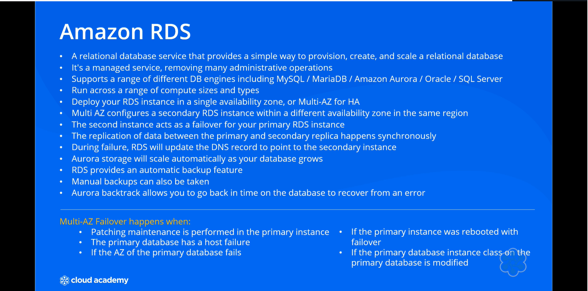
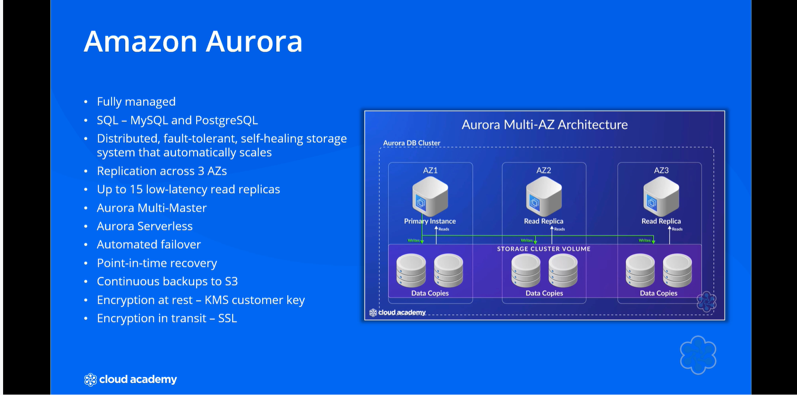

# 🛢️ Amazon Relational Database Service (RDS)

## 🧩 Definition  
**Amazon Relational Database Service (RDS)** is a **managed service** by AWS that simplifies the **provisioning, creation, and scaling** of relational databases.  

- Supports multiple **database engines**, including **MySQL, MariaDB, PostgreSQL, Amazon Aurora, Oracle,** and **SQL Server**, each offering different **licensing** and **performance** options.  
- Users can select from various **compute instances** to run their databases, categorized into **general-purpose** and **memory-optimized** types, providing flexibility for different workloads.  
- **Multi-AZ (Availability Zone) deployments** ensure **high availability** and **resiliency**, providing **automatic failover** to a secondary instance if the primary fails.  
- Offers multiple **storage options**, including **general-purpose SSD**, **provisioned IOPS SSD**, and **magnetic storage**, with **storage autoscaling** to adjust capacity based on demand.  
- Allows both **vertical scaling** (increasing compute resources) and **horizontal scaling** through **read replicas** to handle **read-only traffic** and enhance performance.  
- AWS manages critical **administrative tasks** like **patching**, **automated backups**, and **maintenance**, while also supporting **manual snapshots** and **Aurora’s Backtrack** feature for **time-based recovery**.  
- Encourages users to explore **hands-on labs** for practical experience with Amazon RDS.  

---

---

## 🧩 Analogy: RDS as a Fully Equipped Kitchen  

Imagine you’re opening a **restaurant** and need a **kitchen** to prepare your meals.  
**Amazon RDS** is like having a **fully equipped kitchen** provided for you — you don’t need to worry about **buying appliances**, **setting them up**, or **maintaining them**.  

- 🍳 AWS acts as the **property manager**, ensuring the kitchen’s **equipment** is operational, **up-to-date**, and **meets health standards**.  
- 🥘 You choose what **meals (databases)** to prepare using **tools and ingredients (database engines like MySQL, PostgreSQL, etc.)** provided by AWS.  
- 👨‍🍳 This lets you focus on **creating your menu (developing applications)** without worrying about **kitchen (database) management**.  

---

## ⚙️ Key Features and Characteristics  

- 🧩 **Managed Service** – AWS handles provisioning, patching, backups, and maintenance.  
- 🗄️ **Multiple Database Engines** – Supports MySQL, MariaDB, PostgreSQL, Aurora, Oracle, and SQL Server.  
- 💾 **Flexible Storage Options** – Choose between General Purpose SSD, Provisioned IOPS SSD, or Magnetic storage.  
- 📈 **Scalability** – Supports vertical scaling (compute power) and horizontal scaling (read replicas).  
- 🧱 **High Availability** – Multi-AZ deployments provide automatic failover and increased fault tolerance.  
- 🔁 **Automated Backups & Snapshots** – Simplifies recovery and ensures data durability.  
- ⚙️ **Storage Autoscaling** – Dynamically adjusts storage capacity based on usage.  
- 💡 **Performance Optimization** – Memory-optimized instance types for high-performance workloads.  
- 🧠 **Hands-On Learning** – Encourages practical experience through AWS labs and exercises.

---

## Amazon Aurora

