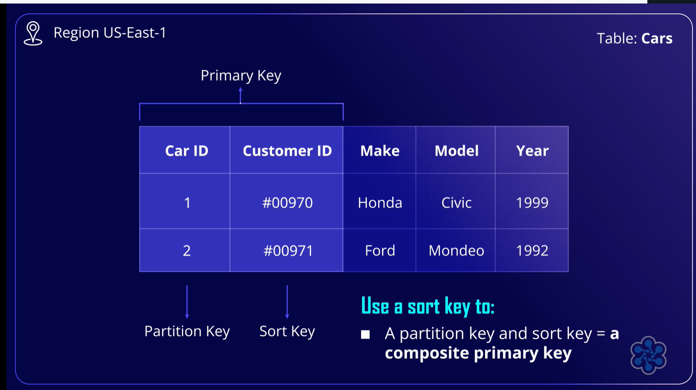

# 🧩 Amazon DynamoDB

## 🧠 Definition  
**Amazon DynamoDB** is a **fully managed, serverless NoSQL database service** designed for **high-scale OLTP workloads** with built-in **data durability**.  

Key characteristics:  
- Eliminates the need for **database administration, server management, or manual backups** — AWS handles infrastructure.  
- **Highly available**, with automatic replication across multiple **Availability Zones**.  
- Provides **consistent, low-latency performance** for read and write operations, supporting both **eventual** and **strong consistency**.  
- **Scalable**: adjust provisioned throughput or use on-demand capacity to match application demands.  
- Supports **ACID transactions** for critical operations.  
- Ideal for **gaming, e-commerce, transportation**, or any application needing **serverless architecture, scalability, and predictable access patterns**. 
    - "Serverless" indicates that server management is invisible to the user, with AWS managing all server-related tasks.
- Supports **key-value** and **document** data models.  
    - Key-value databases consist of unique key-value pairs, allowing quick data access and requiring high partitionability and scalability, which DynamoDB provides.
- Maximum item size: **400 KB**; larger objects can use **Amazon S3**.  
- **DynamoDB Accelerator (DAX)** reduces response times from milliseconds to microseconds.  
- **Global Tables** enable **cross-region replication** for low-latency access and enhanced availability.

---

## 📚 Analogy: Automated Library  

Imagine DynamoDB as a **vast, automated library**:  
- **Tables** are like **library shelves** holding your data (books).  
- DynamoDB acts as the **librarian**, organizing, storing, and retrieving data **instantly**, without manual management.  
- **Multiple copies of each book** in different sections (Availability Zones) ensure access even if one section is inaccessible — representing **high availability and durability**.  
- A **fast-track system for popular books** is like **DAX**, which accelerates access to frequently requested data.  

No matter how much data you add, DynamoDB finds and retrieves it quickly, automatically maintaining reliability and performance.

---

## ⚙️ Features and Considerations  
- 🔄 **Fully managed, serverless** database.  
- 🛡️ **High availability** via multi-AZ replication.  
- ⚡ **Millisecond performance**, with DAX for microsecond-level caching.  
- 🌍 **Global Tables** for cross-region replication.  
- 💾 Supports **key-value** and **document** models; max item size **400 KB**.  
- 🔐 ACID transactions for critical operations.  
- 🔧 Scalable throughput for variable workloads.

---

## ⚖️ Key Takeaways  
- Eliminates infrastructure management; AWS handles scaling, replication, and backups.  
- Provides **fast, predictable, and durable performance** for serverless applications.  
- DAX enhances frequently accessed data performance.  
- Global Tables improve **low-latency, cross-region access**.  
- Suitable for applications with **high transaction volumes** and **variable access patterns**. 

---

# 🧩 Amazon DynamoDB Availability, Durability, and Use Cases

## 🧠 Definition  
Amazon DynamoDB is designed for **high availability, durability, and scalable OLTP workloads**. Key attributes include:  

- **High availability & durability**: Data is automatically **replicated across three Availability Zones** within a region to ensure resiliency during outages.  
- **Consistency models**: Supports **eventual consistency by default**, with an option for **strong consistency** for applications that need the most up-to-date data, though strong consistency may impact performance.  
- **ACID transactions**: Guarantees operations are **fully completed or rolled back**, critical for applications like banking.  
- **Global Tables**: Enable **cross-region replication**, providing **low-latency access** from multiple geographic locations.  
- **Backup options**:  
  - **On-demand backups** for compliance and auditing  
  - **Point-in-time recovery (PITR)** to revert to previous database states within the last 35 days  
- **Scalability**: Infinitely scalable with **consistent performance** regardless of table size, unlike traditional relational databases.  

DynamoDB is best suited for **OLTP workloads** requiring high scalability and durability, particularly for **serverless or new applications**.  

It is **not recommended** for:  
- OLAP workloads  
- Applications requiring **ad-hoc query access**, where relational databases are more appropriate  

**Common use cases**:  
- Gaming  
- E-commerce  
- Transportation  

---

## ⚙️ Features and Considerations  
- 🔄 **Automatic replication across 3 AZs** for high availability.  
- ⚡ **Eventual and strong consistency** options.  
- 🛡️ **ACID-compliant transactions** for critical operations.  
- 🌍 **Global Tables** for low-latency, cross-region access.  
- 💾 **On-demand backups and PITR** for data protection.  
- 📈 **Infinite scalability** with consistent performance.  
- ⚠️ Not ideal for OLAP or ad-hoc querying.  

---

## ⚖️ Key Takeaways  
- Provides **highly available, durable, and serverless OLTP database capabilities**.  
- Supports **ACID transactions and cross-region replication** for critical and distributed applications.  
- **Backup and PITR features** ensure data protection and recovery.  
- Perfect for applications in **gaming, e-commerce, and transportation**.  
- Avoid using DynamoDB for **ad-hoc analytics or relational OLAP workloads**.  

---

# 🧩 Amazon DynamoDB Data Modeling & Capacity Management

## 🧠 Definition  
DynamoDB requires **data modeling knowledge** and an understanding of key concepts for efficient design and cost management:

- **Tables**: Collections of **items** (similar to rows or records).  
- **Items**: Individual entries in a table with **attributes** (similar to columns).  
- **Partition Key**: Unique identifier for an item, used to **logically partition data**.  
- **Sort Key**: Optional; used with partition keys to create a **composite primary key**, allowing non-unique partition keys and efficient querying.

- **Attributes**: Data fields that describe items. 

---

## ⚙️ Capacity Modes

### Provisioned Throughput Mode  
- **Definition**: Specify the amount of read and write capacity for your table by setting **Read Capacity Units (RCUs)** and **Write Capacity Units (WCUs)**.  
- **RCU and WCU Calculations**:  
  - 1 RCU = 1 strongly consistent read per second for an item up to 4 KB  
  - 0.5 RCU = 1 eventually consistent read per second for an item up to 4 KB  
  - 2 RCUs = 1 transactional read per second  
  - 1 WCU = 1 write per second for an item up to 1 KB  
  - 2 WCUs = 1 transactional write per second  
- **Traffic Management**: Ideal for **steady traffic patterns**; can use **DynamoDB Auto Scaling** to adjust RCUs and WCUs automatically within specified limits.  
- **Cost Considerations**: Pay for **provisioned RCUs and WCUs** regardless of usage (No Requests you still pay); can reserve capacity for **discounted rates**.  
- **Auto Scaling**: Automatically adjusts provisioned throughput to handle traffic spikes and prevent request failures.  
- **Use Cases**: Suitable for applications with **predictable traffic patterns** or those benefiting from **reserved capacity discounts**.  

### On-Demand Capacity Mode  
- **Definition**: Automatically adjusts **read and write capacity** based on application traffic. Eliminates manual calculation of RCUs and WCUs and handles scaling automatically.  
- **Pricing**: Pay **only for the requests and storage used**; generally **more expensive per request** than provisioned mode, but no cost for unused capacity.  
- **Use Cases**: Ideal for **unpredictable workloads** or applications experiencing **sudden traffic spikes**.  
- **Comparison with Provisioned Mode**: Unlike provisioned throughput, which charges for capacity regardless of usage, on-demand mode **charges based on actual usage**, making it cost-effective for variable workloads.  

---

## ⚙️ Features and Considerations  
- 🗂️ Data stored in **tables → items → attributes**.  
- 🔑 **Partition key** ensures uniqueness; **sort key** allows efficient querying with composite keys.  
- ⚖️ Provisioned mode: predictable capacity, manual RCU/WCU calculations, Auto Scaling optional.  
- ⚡ On-demand mode: automatic scaling, pay-per-use, best for variable workloads.  
- 💰 Pricing depends on **mode selected** and **usage patterns**.  

---

## ⚖️ Key Takeaways  
- Understanding **partition and sort keys** is critical for data modeling.  
- **Provisioned throughput**: predictable performance for steady workloads; can benefit from reserved capacity discounts.  
- **On-demand throughput**: best for unpredictable traffic patterns; pay only for what you use.  
- Effective data modeling ensures **fast queries and scalable performance**.  