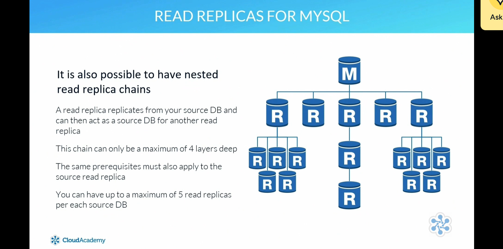

# 📌 Amazon RDS Read Replicas

## 🧠 Overview
- 📖 **Read replicas** provide read-only access to database data
- 🚀 Improve performance by offloading read traffic from the primary RDS instance
- ❌ Not intended for resiliency or automatic failover
- 📸 Created from a snapshot of the primary database
- 🔁 Maintain an asynchronous link for data replication

---

## 🛠️ Supported Engines
Read replicas are available for:

- MySQL  
- MariaDB  
- PostgreSQL  

Each engine has specific requirements and limitations.

---

## 📈 Scaling & Deployment
- ➕ Multiple read replicas can be deployed to scale read performance
- 🌍 Can be placed in different regions for enhanced disaster recovery
- 🔄 Can be promoted to replace the primary database during incidents or maintenance

---

## 🐬 MySQL Read Replicas
- 🔁 Used to improve database performance by offloading read-only traffic from the primary database
- ❌ Not intended for failover or resiliency
- 📊 Handles read-intensive operations to enhance overall performance
- 📸 Created from a snapshot of the primary database
- 🔄 Maintains an asynchronous replication link with the primary
- 🐘 Requires MySQL 5.6 or later
- 🗂️ Automatic backup retention must be set to one or more
- 🛢️ Replication supported only with the InnoDB storage engine (not MyISAM)
- 🔁 Nested read replica chains allowed, up to four layers deep
- ➕ Up to five read replicas per source database
- 🔄 In the event of a primary outage:
  - RDS redirects the read replica source to the secondary database for continued replication
- 📊 Monitoring via Amazon CloudWatch using the **ReplicaLag** metric
  - Ensures synchronization with the source database

---

## 🦭 MariaDB Read Replicas
- 🔁 Used to offload read-only traffic from the primary database, improving performance
- ❌ Not intended for failover or resiliency
- 📸 Created from a snapshot of the primary database
- 🔄 Maintains an asynchronous replication link with the primary
- 🌍 Can be deployed in different regions for enhanced disaster recovery
- ⚡ Can be promoted to replace the primary database during incidents or maintenance
- 🗂️ Requires a backup retention period greater than zero
- ➕ Allows up to five read replicas per source database
- 🔁 Nested read replica chains are possible, up to four layers deep
- 📊 Monitoring via Amazon CloudWatch using the ReplicaLag metric
  - Ensures synchronization with the source database

---

## 🐘 PostgreSQL Read Replicas
- 🔄 Use native PostgreSQL streaming replication
- 🔁 Asynchronous data replication between primary and read replica
- 📤 Write-Ahead Log (WAL) data is sent from the master to the read replica
- 👤 A specific replication role is created:
  - Handles replication tasks only
  - Does not have permission to modify data
- 🛡️ Multi-AZ read replica instances can be created
  - A secondary read replica can be configured in a different AZ for additional resilience
- ❌ Does not support nested read replicas
- 📊 Monitoring available using:
  - Amazon RDS ReplicaLag metric
  - Ensures synchronization with the source database

---

## 📊 Monitoring & Synchronization
- 👀 Monitoring is crucial to ensure replicas stay synchronized
- 📈 Amazon CloudWatch provides metrics such as:
  - ReplicaLag  
- ⏱️ ReplicaLag helps measure delay between primary and replica

---

## 🧠 Analogy

Imagine you have a popular cookbook that everyone in your family wants to read at the same time.

- 📚 If you only have one copy, everyone must wait their turn
- ⏳ This causes delays

To fix this:
- 📄 You make several photocopies
- 🏠 Place them in different rooms
- 👥 Family members can read at the same time

---

### 💡 In IT Terms
- 📘 Original cookbook = Primary database  
- 📄 Photocopies = Read replicas  
- 👀 Family reading = Read-only queries  
- ✍️ Only the original can be updated = Only the primary handles writes  

---

## 🎯 Key Benefit
- 🚀 Faster read performance
- 🛡️ Reduces load on the primary database
- ❌ Not designed for automatic failover