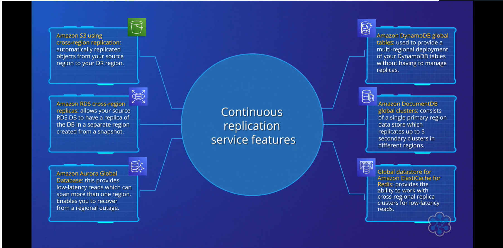

# 📌 Backup & Restore Architecture

## 🧠 Overview
- 🏗️ Backup & Restore is a disaster recovery strategy suited for deployments with **low business risk**
- ⏱️ Characterized by **longer RTO and RPO values**
- ⏳ Typical RTO: **24 hours or less**
- 💾 Typical RPO: **Measured in hours**
- 🌍 Can be implemented across multiple **Availability Zones (AZs)** and regions
- 🛡️ Protects against both AZ-level and regional outages

---

## 🛠️ AWS Services Used

Backup & Restore relies on AWS-managed services for backups and recovery:

- 📸 **RDS Snapshot**
- 📸 **Amazon Aurora DB Snapshot**
- 💾 **DynamoDB Backup**
- 🔄 Point-in-time recovery
- 🗓️ Scheduled backups

---

## 🗂️ AWS Backup
- 🧰 Centralizes backup management across multiple regions
- ✅ Provides auditability and compliance controls
- 📦 Supports multiple services including:
  - Amazon EC2  
  - RDS  
  - Aurora  
  - DynamoDB  
  - EFS  
  - And more  
- 📋 Uses backup policies and backup plans
- 🎯 Helps manage RPO requirements

---

## 🌍 Multi-Region & Multi-AZ Protection
- 🏢 Can operate in a single region across multiple AZs
- 🌎 Can replicate backups across multiple regions
- 🔁 Supports cross-region replication and restoration
- 🛠️ Uses services such as:
  - Amazon S3  
  - AWS Backup  
  - Data Lifecycle Manager (DLM)

---

## 🔄 Recovery Process Example
- 💥 If an AZ fails:
  - Restore services within the same region
- 🌪️ If a region fails:
  - Restore services in a secondary region using replicated backups
- ⏳ Recovery time depends on the volume of data and restoration process

---

## 🎯 Key Takeaway
- 📊 Proper planning is required to manage RTO and RPO
- 🧰 AWS-managed services help implement effective backup and restore strategies
- 🛡️ Designed for cost efficiency over rapid recovery speed

---

## 🧠 Analogy

Imagine your business data is like a collection of important family photos stored on your computer.

To protect them:
- 💽 You regularly copy them to an external hard drive or cloud storage

The **Backup & Restore** strategy works the same way:
- 📂 You create regular backups of important data
- 💥 If something goes wrong (system failure or data loss)
- 🔄 You restore from the backup copies
- 📸 Everything returns to how it was before the issue

### 🔐 Extra Protection
- ⏰ The more frequently you back up, the less data you risk losing
- 🌍 Keeping copies in different locations protects against larger disasters like fire or theft

---

# 📌 Pilot Light Architecture

## 🧠 Overview
- 🔦 The **Pilot Light** method follows Backup & Restore in complexity
- 🔁 Focuses on continuous data replication between primary and disaster recovery (DR) regions
- 🎯 Designed to reduce **Recovery Point Objective (RPO)**
- 🏗️ Maintains core infrastructure in the DR region
- ⚡ Enables faster scaling of resources using AWS CloudFormation
- 🌍 Requires deployment across multiple regions
- 🔄 Changes in the primary region are mirrored in the DR region using tools like AWS CloudFormation

---

## 💾 Data Replication & RPO
- 🔁 Continuous asynchronous data replication between regions
- 📉 Significantly reduces RPO
- 🛠️ AWS services supporting replication include:
  - Amazon S3  
  - Amazon RDS  
  - Amazon Aurora  
  - Amazon DynamoDB  
  - Amazon DocumentDB  
  - Amazon ElastiCache for Redis  
- ⏱️ Each service has minimal replication latency
- 📦 Data is quickly available in the DR region

---

---

## ⏱️ Impact on RTO
- 🔄 Failover process varies depending on the service
- ⏳ Provisioning time affects **Recovery Time Objective (RTO)**
- ⚡ Core infrastructure is already operational in the DR region
- 🏗️ Other resources must be provisioned and scaled during failover
- 📌 For shorter RTO requirements, a **Warm Standby** strategy may be considered

---

## 🏗️ Architecture Example (3-Tier Web Application)
- 🌐 Minimal infrastructure remains active in the DR region
- 🧩 Core components are always running at reduced capacity
- 🚨 In a disaster scenario:
  - 🔄 Activate the secondary load balancer  
  - 🖥️ Provision application servers using pre-configured AMIs  
  - 🗄️ Promote the Aurora Replica to the primary data store  

---

## 🎯 Key Characteristics
- 🔁 Replication reduces RPO
- 🏗️ Core infrastructure is always running in the DR region
- ⚡ Remaining resources are ready to be provisioned
- ⏳ Provisioning time impacts RTO

---

## 🧠 Analogy

Imagine your business is like a campfire that needs to keep burning.

### 🔥 Traditional Backup
- ❌ If the fire goes out, you must:
  - Gather wood  
  - Set up the fire pit  
  - Start the fire from scratch  
- ⏳ This takes time

---

### 🔦 Pilot Light Strategy
- 🔥 You always keep a small flame burning in a safe place
- 💨 If the main fire goes out:
  - You use the small flame to quickly relight it
  - You don’t start from nothing
- ⚡ You already have the essential setup ready
- 🚀 You can return to full strength much faster

---

### 💡 In IT Terms
- 🏗️ Core systems and data are replicated and running at minimal capacity in a secondary region
- 🚨 If disaster occurs, you scale up from this “small flame”
- 🔄 Avoid rebuilding everything from the ground up

---

# 📌 Warm Standby Architecture

## 🧠 Overview
- 🔥 **Warm Standby** provides better RTO and RPO than Backup & Restore and Pilot Light
- 🏗️ Maintains a scaled-down version of the primary region’s infrastructure in a designated DR region
- 🟢 The DR environment is always operational
- ⚡ Allows immediate processing of requests during a regional failure
- 💰 Higher cost due to continuously running resources in the DR region

---

## 🌍 Architecture Design
- 🏢 A scaled-down but fully functional infrastructure runs in the DR region
- 🧰 Uses the same AWS services as Backup & Restore and Pilot Light for data replication
- 🔁 Data is replicated across regions
- 🛠️ DR region infrastructure includes:
  - ELB  
  - VPC  
  - Aurora replica  
  - Tier 1 web servers  
  - Tier 2 application servers  

---

## 🔄 Failover Process
- 🚨 In the event of a regional failure:
  - 🌐 Route 53 redirects traffic to the DR region
  - 🟢 Infrastructure is already running and ready to handle requests
- 🗄️ Write forwarding is enabled on the Aurora replica
- 🔁 Ensures data consistency across regions

---

## ⏱️ Impact on RTO and RPO
- 📉 Reduced RTO because resources are pre-provisioned
- 💾 Improved RPO through cross-region data replication
- 📈 Scaling out may be required to handle increased workload
- ⚠️ Scaling may cause temporary connectivity issues

---

## 💰 Cost Consideration
- 💵 More expensive than Backup & Restore and Pilot Light
- 🏗️ Additional resources are continuously running in the DR region

---

## 🚀 Advanced Option
- 🌍 Multi-site Active/Active can further enhance recovery capabilities
- 💰 However, it is more costly

---

## 🧠 Analogy

Imagine you own a popular restaurant (your main site), and you want to ensure customers are always served.

### 🍽️ Warm Standby Setup
- 🏢 You have a second, smaller kitchen in another location
- 👨‍🍳 It is running with fewer staff and less equipment
- ⚡ It can handle a small number of customers at any time

---

### 🚨 If Disaster Strikes
- ❌ Your main kitchen closes
- 🚀 You quickly bring in more staff and equipment
- 🍽️ The standby kitchen scales up to serve all customers

---

### ⚖️ Comparison
- 🧊 Faster than starting from scratch (cold site)
- 🔦 Faster than just having ingredients ready (Pilot Light)
- 🔥 Not as instant as having two fully staffed kitchens running at all times (hot standby)
- 🎯 Balances cost and speed of recovery

---

# 📌 Multi-Site Active/Active Architecture

## 🧠 Overview
- 🌍 **Multi-Site Active/Active** is the most complex and costly disaster recovery strategy
- ⏱️ Provides the lowest **Recovery Time Objective (RTO)**
- 💾 Provides the lowest **Recovery Point Objective (RPO)**
- 🎯 Designed for critical applications
- 🚫 Does not require provisioning additional resources after a disaster
- 🏗️ Infrastructure is deployed at full scale across multiple regions
- ❌ No designated DR region
- 🌐 Applications and services can be accessed from any region

---

## 🏗️ Architecture Design
- 🌎 Multiple regions actively run workloads simultaneously
- 🌐 Route 53 routes traffic based on specific routing policies
- ⚖️ ELB balances requests across availability zones
- 🔁 DynamoDB global tables:
  - Enable automatic data replication
  - Provide continuous backups in both regions
- 🛡️ Ensures application functionality even if one region fails

---

## 🚨 Failure Behavior
- ❌ If one region fails:
  - ✅ The remaining region continues serving traffic
  - 🔄 No need to trigger failover events
  - ⚡ No additional infrastructure needs to be provisioned

---

## ⚠️ Important Considerations
- 🧪 DR strategy must be tested regularly
- 📈 Remaining regions must handle increased traffic if one fails
- 💥 Data corruption or deletion may still require database restoration
- ⏳ Database restoration can impact RTO

---

## 💰 Cost & Complexity
- 💵 Most expensive recovery strategy
- 🏗️ Requires full-scale infrastructure in multiple regions
- 🛠️ Higher operational complexity

---

## 🧠 Analogy

Imagine you own a popular coffee shop chain with two fully equipped branches in different parts of the city.

### ☕ Normal Operations
- 🏢 Both branches are open every day
- 👥 Both serve customers at the same time
- 🔄 Customers receive the same service and experience

---

### 🚨 If One Branch Closes
- ❌ One branch shuts down due to power cut or renovation
- 🚶 Customers immediately go to the other branch
- ⚡ No waiting and no service interruption

---

### 💡 In IT Terms
- 🌍 Applications and data run fully in multiple regions at once
- 🔄 If one region fails, users are automatically served by the other
- ⏱️ No need to wait for systems to be restored
- 💰 More complex and costly, but ensures fastest recovery and no data loss for critical services