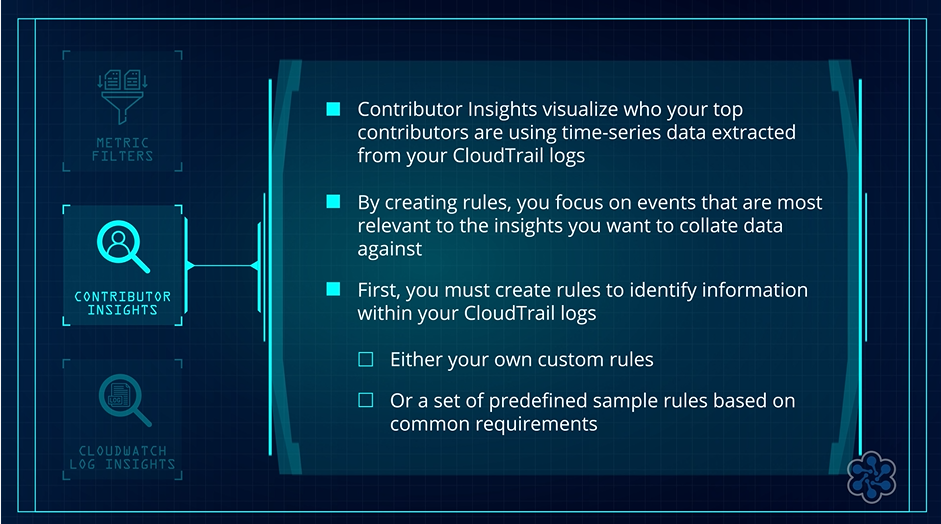

# 📊 AWS CloudTrail and Amazon CloudWatch Integration

## 🧩 Overview

**AWS CloudTrail** can integrate with **Amazon CloudWatch** to enhance **monitoring and security insights** across your infrastructure.

Delivering CloudTrail event logs to CloudWatch is **optional** and requires configuration:

- ⚙️ During **trail creation**
- ✏️ By **editing an existing trail**

---

## ⚙️ CloudTrail Log Delivery Configuration

When configuring CloudTrail to deliver logs to CloudWatch, users can:

- 📊 Select an existing **CloudWatch Log Group**.
- ➕ Create a new **CloudWatch Log Group**.
- 🔐 Assign a **role** for CloudTrail to publish logs.

The role requires permissions for:

- 📝 Creating **log streams**.
- 📤 Delivering **events**.

### 🎯 Basic Flow

**CloudTrail Events → CloudWatch Log Group → CloudWatch Monitoring and Analysis**

---

## 🛡️ Security Monitoring

CloudWatch provides security monitoring capabilities using CloudTrail event logs.

It can provide notifications for:

- 🔐 **Unauthorized changes to security groups**
- 🛡️ **Unauthorized changes to IAM policies**
- ❌ **Unsuccessful API requests**

This helps identify potential security issues within the infrastructure.

---

## 🔍 Analyzing CloudTrail Data

CloudWatch provides multiple tools for extracting meaningful insights from CloudTrail data:

- 📊 **Metric Filters**
- 🔎 **CloudWatch Log Insights**
- 👥 **Contributor Insights**

These tools allow users to analyze CloudTrail logs and identify relevant activity.

---

## 📊 Metric Filters

---

## 👥 Contributor Insights

---

## 🔎 CloudWatch Log Insights

---

## 🚨 Proactive Monitoring

The CloudWatch features used with CloudTrail enable **proactive detection** of:

- 🛡️ **Security risks**
- 📈 **Performance issues**
- ⚠️ **Potential infrastructure problems**

---

## ⚖️ Key Benefits

- 🔗 Integrates **CloudTrail with CloudWatch** for enhanced monitoring.
- 📊 Allows CloudTrail events to be delivered to **CloudWatch Logs**.
- 🔐 Supports security monitoring for unauthorized changes and unsuccessful API requests.
- 📊 Uses **Metric Filters** to search logs and trigger notifications.
- 👥 Uses **Contributor Insights** to visualize top contributors.
- 🔎 Uses **CloudWatch Log Insights** to query and analyze log data.
- 📝 Provides **pre-built sample queries** for various use cases.
- 🚨 Enables proactive detection of **security risks and infrastructure problems**.

### 🧠 Key Idea

**CloudTrail records AWS activity → CloudWatch receives the logs → CloudWatch tools analyze the logs → Security and infrastructure issues can be detected proactively.** 

---

## 🧠 Analogy: CloudTrail and CloudWatch as a Smart Security System

Imagine your **AWS environment as a large office building**.

- 📹 Every time someone enters a room, uses a printer, or changes a lock, a **security camera records the activity**.
- 🕵️ This is similar to **AWS CloudTrail**, which logs every action taken in your AWS account.

Now imagine you have a **smart security system**, similar to **Amazon CloudWatch**.

- 👀 The system not only stores the camera recordings but also **watches them in real time**.
- 🚨 You can set up alerts so that if someone:
  - 🚪 Tries to open a **restricted door**.
  - ❌ Makes too many **failed attempts** to access a room.
  
  The system can immediately **notify you**.

- 🔍 You can also analyze the recorded activity to identify patterns, such as:
  - 🚪 Which rooms are accessed most.
  - 👤 Who is making changes to **security settings**.

### 🎯 Key Idea

**CloudTrail = Records the activity**

**CloudWatch = Monitors and analyzes the activity**

Together, CloudWatch helps you **monitor, analyze, and respond to important activities and potential security risks** captured by CloudTrail, similar to how a smart security system keeps a building safe by **watching and interpreting security footage**.