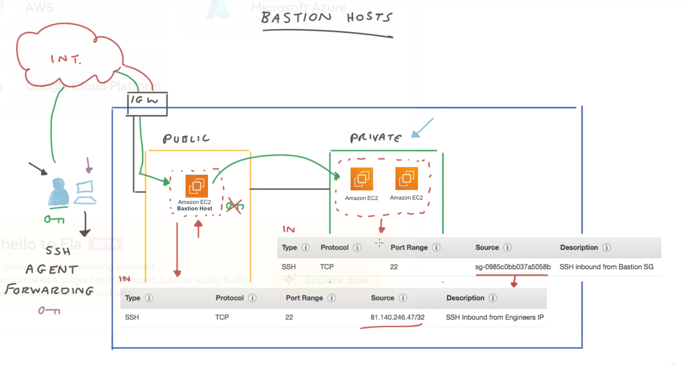

# 🏰 Bastion Host  

## 🧩 Definition  
A **Bastion Host** (also known as a **jump server**) is a **securely configured EC2 instance** used to **remotely access instances in private subnets** from an **external network**, such as a corporate office or home connection.  

It acts as a **controlled entry point** for administrative access, allowing engineers to connect to private resources without exposing them directly to the internet.  

---

## 🏗️ Architecture Overview  

A typical bastion host setup involves:  
- A **VPC** containing both **public** and **private** subnets.  
- An **Internet Gateway (IGW)** attached to the VPC for internet connectivity.  
- A **bastion host EC2 instance** placed in the **public subnet**, with a **public IP address**.  
- **Private EC2 instances** hosted in the **private subnet**, with **no public IPs**.  

### 🔐 Key Security Configurations  
- The **bastion host’s security group** only allows **SSH (port 22)** from **specific, trusted IP addresses** (e.g., the engineer’s home IP).  
- The **private instances’ security groups** allow **SSH access only from the bastion host’s security group**, not from the internet.  
- **SSH agent forwarding** is used to authenticate connections — ensuring **private keys remain on the local machine**, never stored on the bastion host.  
- The bastion host is **hardened**, meaning unnecessary services are disabled, and it is regularly patched to reduce attack surfaces.  

---

## 🧭 How It Works  
1. The engineer initiates an **SSH connection** from their local computer to the **bastion host** in the **public subnet**.  
2. Once connected, the engineer **SSHs from the bastion host** into an **EC2 instance** in the **private subnet**.  
3. This setup allows **secure access** to private instances **without exposing them** to the public internet.  

---

---

## 🧩 Analogy: The Bastion Host as a Castle Drawbridge  

Imagine your private network as a **medieval castle** 🏰 surrounded by a **moat** 🌊 (the internet).  
Inside the castle are your **valuable resources** — the private EC2 instances.  

To reach them securely, there’s a **single drawbridge**, representing the **bastion host**.  

- The **drawbridge** is **tightly guarded** — only trusted knights (engineers) are allowed to cross, and only at specific times or under certain conditions (IP restrictions).  
- Once across, the knight can move freely inside the castle (the private subnet) to reach the servers.  
- The drawbridge is **monitored and reinforced** to prevent intruders from sneaking in.  

In short, the bastion host provides a **secure and controlled entry point**, much like the drawbridge that allows safe access into the castle while keeping enemies out.  

---

## ⚙️ Best Practices  

- 🧱 **Restrict SSH access** to known IP addresses only.  
- 🗝️ **Use SSH agent forwarding** — never store private keys on the bastion host.  
- 🧩 **Place the bastion host in a public subnet** with access to the internet through an IGW.  
- 🔐 **Harden the bastion host** by disabling unnecessary ports, services, and users.  
- 🕵️ **Enable logging and monitoring** with **AWS CloudTrail**, **AWS Config**, or **Amazon CloudWatch Logs** to track SSH activity.  
- ⚙️ **Rotate keys regularly** and enforce **multi-factor authentication (MFA)** for additional security.  

---

## 🌍 Summary  

| Feature | Description |
|----------|-------------|
| **Purpose** | Provides secure SSH access to private subnet instances |
| **Placement** | Public subnet |
| **Access Type** | Inbound SSH from trusted IPs only |
| **Key Management** | Private keys remain on the user’s local machine |
| **Outbound Access** | To private subnet instances |
| **Security** | Hardened instance, restricted access, monitored activity |