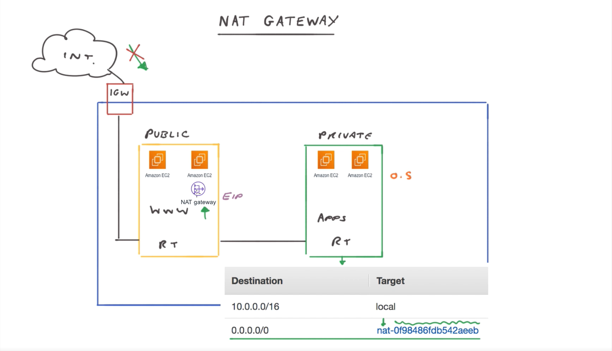

# 🌉 NAT (Network Address Translation) Gateway  

## 🧩 Definition  
A **NAT Gateway** is a managed AWS service that enables **instances in private subnets** to access the **internet** or **other AWS services** while **preventing inbound traffic** from the internet. It provides a **secure**, **scalable**, and **highly available** solution for outbound internet connectivity within a **Virtual Private Cloud (VPC)**.  

- Allows **instances without public IP addresses** to initiate **outbound connections** to the internet.  
- **Blocks inbound traffic** initiated from the internet, ensuring **network security**.  
- Deployed in a **public subnet** and requires an **Elastic IP address** to route traffic through an **Internet Gateway (IGW)**.  
- For instances in private subnets to access the internet, the **private subnet’s route table** must be updated to direct traffic to the **NAT Gateway**.  
- **Managed by AWS**, providing **automatic scaling** and **high availability**.  
- AWS may create **multiple underlying NAT Gateways** for resiliency, though only **one appears** in the user account.  
- For **multi-AZ deployments**, a **separate NAT Gateway** is required in **each public subnet**, as AWS does not replicate them across zones automatically.  
- **Preferred over NAT Instances** due to better **performance**, **scalability**, and **ease of management**.  

---

---

## 🧩 Analogy: NAT Gateway as Your Home’s Shared Mailbox  

Imagine your **home** has a **single mailbox** that all residents use for sending and receiving mail — that mailbox represents the **NAT Gateway**.  

- 🏠 Each **family member** (private instance) can send letters (internet requests) to the outside world through the **shared mailbox**.  
- 📬 The **post office (internet)** only sees the **house’s main address** (the NAT Gateway’s public IP), not individual room numbers (private IPs).  
- 💌 When mail (responses) comes back, the NAT Gateway **distributes it** to the correct resident based on **internal records**.  
- 🚫 Outsiders **cannot directly send mail** to a resident — they can only **reply** to what was sent out first, preserving **security**.  

This setup allows private resources to **communicate outward safely** without exposing themselves directly to the public internet.  

---

## ⚙️ Key Features and Characteristics  

- 🌐 **Outbound Internet Access** – Enables private instances to connect to the internet or AWS services.  
- 🚫 **Inbound Traffic Blocked** – Prevents unsolicited inbound traffic from external sources.  
- 🏗️ **Deployed in Public Subnet** – Must reside in a **public subnet** with an **Elastic IP** and **Internet Gateway**.  
- 🗺️ **Routing Configuration** – Private subnet route tables must direct **0.0.0.0/0** traffic to the NAT Gateway.  
- ⚙️ **Managed Service** – AWS handles **scaling**, **fault tolerance**, and **availability**.  
- 🌍 **Availability Zone Scope** – Each NAT Gateway operates within **a single AZ**; use multiple for **multi-AZ resiliency**.  
- 🚀 **Performance & Scalability** – Can handle **burst traffic** automatically with minimal management.  
- 🔄 **Replacement for NAT Instances** – Offers improved **ease of use**, **throughput**, and **automatic updates**.  

---

## 💡 Best Practice  

- Deploy **one NAT Gateway per Availability Zone** for **high availability**.  
- **Avoid cross-AZ routing** to minimize latency and data transfer costs.  
- Regularly **monitor NAT Gateway metrics** (e.g., connections, bytes processed) in **Amazon CloudWatch** to ensure performance.  

---