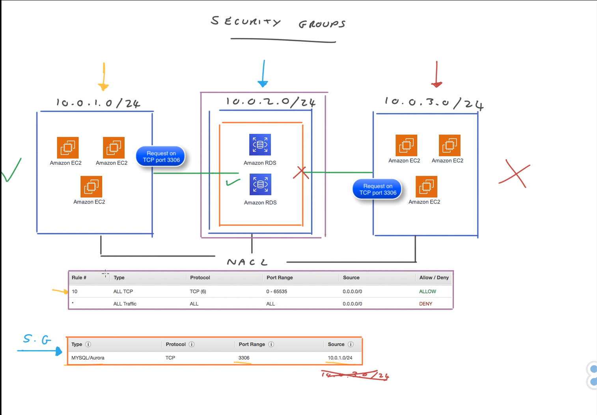

# 🛡️ Security Groups  

## 🧩 Definition  
**Security Groups** in AWS act as **virtual firewalls** that control **inbound and outbound traffic** at the **instance level**, unlike **Network Access Control Lists (NACLs)** which operate at the **subnet level**.  

- Used to **filter traffic** to and from individual AWS resources (e.g., EC2 instances, RDS databases).  
- **Stateful** – if a request is allowed in one direction, the **response is automatically allowed** without needing an additional rule. They **automatically remember** and **allow return traffic for established connections**.
- **No rule numbers** – all rules are **evaluated together**, and if a rule allows traffic, it is permitted.  
- If **no rule exists** for specific traffic, it is **denied by default**.  
- Commonly used to **control access** to instances, such as allowing MySQL (port 3306) or HTTP/HTTPS traffic from specific sources.  
- Can be **associated with multiple resources**, providing flexible and reusable security configurations.  
- Serve as an **instance-level defense layer**, complementing **NACLs** for layered network security.  

---

---

## 🧩 Analogy: Security Groups as Your Home’s Personal Security System  

Imagine your **home** as an **AWS instance**, and your **security system** as a **Security Group**:  

- 🏠 The home (instance) decides **who can enter or leave** based on specific rules.  
- 🔑 You might only allow people with a **key** to enter through the **front door** (like allowing SSH or HTTP on specific ports).  
- 🚫 If someone tries to enter through a window or without a key (unauthorized traffic), they’re **denied access**.  
- 🔁 Once a guest is allowed in, they can **leave freely** — similar to how **Security Groups are stateful**, automatically allowing return traffic.  
- 🧱 This ensures that only **trusted, predefined connections** reach your instance, keeping it secure.  

---

## ⚙️ Key Features and Characteristics  

- 🧩 **Instance-Level Firewall** – Controls traffic at the **instance** rather than the **subnet** level.  
- 🔁 **Stateful** – Return traffic is automatically allowed without explicit rules.  
- ⚙️ **Rule Evaluation** – Rules have **no priority numbers**; all are **evaluated together**.  
- 🚫 **Implicit Deny** – If traffic doesn’t match an allow rule, it’s **denied by default**.  
- 🌍 **Inbound and Outbound Rules** – Define separate rules for incoming and outgoing traffic.  
- 🔒 **Fine-Grained Control** – Specify **protocols, ports, and source/destination IPs or Security Groups**.  
- 🧱 **Reusable and Flexible** – Can be **attached to multiple instances or resources** (e.g., EC2, RDS).  
- 🧩 **Complement to NACLs** – Provides **instance-level security**, while NACLs secure **subnets**.  
- 💡 **Common Use Case** – Allow inbound **SSH (22)** or **HTTP/HTTPS (80/443)** traffic while restricting all other access. 