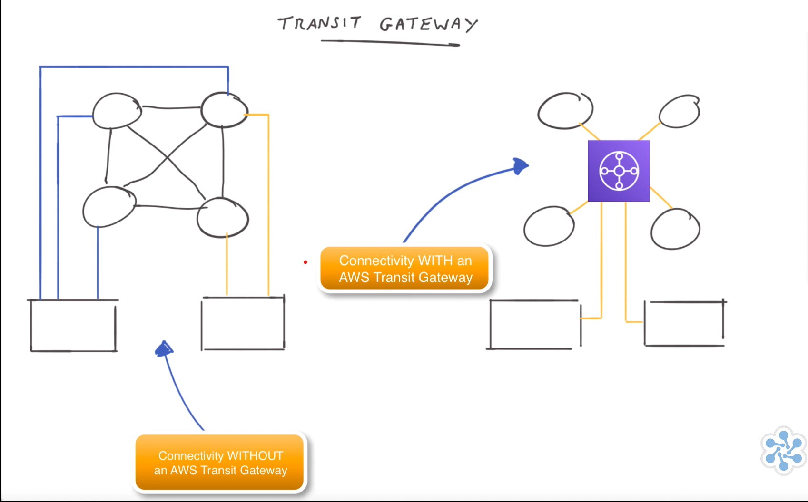

# 🔗 Amazon VPC Peering  

## 🧩 Definition  
**VPC Peering** is a method to **connect two Virtual Private Clouds (VPCs)** within AWS, allowing them to **communicate privately** with each other.  

- Connections can be established between VPCs in the **same or different AWS regions**.  
- The **peering connection** is hosted on **AWS-managed infrastructure**, providing **high resilience**, **no single point of failure**, and **no bandwidth bottlenecks**.  
- VPC Peering is a **one-to-one connection** — if a **third VPC** needs to communicate with the first two, **separate peering connections** must be established.  
- **IP address ranges (CIDR blocks)** of the connected VPCs **must not overlap**; unique ranges are required.  
- The process involves:  
  1. A **requester VPC** sending a **peering request** to an **accepter VPC**.  
  2. Once accepted, both VPCs must **update their route tables** to enable communication.  
- **Security Groups** in each VPC must be **configured** to allow the desired communication between resources.  
- Suitable for **simple, direct connectivity** between VPCs. For larger, multi-VPC networks, **AWS Transit Gateway** is often a better solution.  

---

## 🧩 Analogy: VPC Peering as a Private Pathway Between Houses  

Imagine you live in a **house (VPC 1)** and your friend lives in another **house (VPC 2)**. Both of you have your own **toys (resources like EC2 instances or databases)**.  

- 🏠 You both want to **play with each other’s toys** without going through the **public playground (the Internet)**.  
- 🛣️ **VPC Peering** is like **building a private pathway** directly between your two houses.  
- 🤝 This pathway allows you to **visit each other and share toys directly**, securely, and **without anyone else** being able to use that path.  
- 🔁 It’s a **one-to-one connection** — if you have another friend (**VPC 3**) who wants to connect, you must build **another direct pathway** from your house to theirs.  
- 🔒 This ensures **privacy, direct access**, and **no public exposure**, though it can become complex as more connections are added.  

---

## ⚙️ Key Features and Characteristics  

- 🔗 **Private Connectivity** – Enables private communication between two VPCs.  
- 🌍 **Cross-Region Support** – Can connect VPCs across **different AWS regions**.  
- 🚫 **No Overlapping CIDR Blocks** – Each VPC must have a **unique IP range**.  
- 🔁 **One-to-One Relationship** – Each peering connection links **only two VPCs**.  
- 🧭 **Routing Configuration** – Both VPCs must **update route tables** for traffic flow.  
- 🛡️ **Security Group Rules** – Must be configured to **allow communication** between resources.  
- ⚡ **High Availability** – Managed by AWS with **no bandwidth bottlenecks** or **single points of failure**.  
- 🏗️ **Scalability Consideration** – Works well for **simple architectures**; for many VPCs, use **AWS Transit Gateway** for easier management.  

---

# 🏢 AWS Transit Gateway  

## 🧩 Definition  
**AWS Transit Gateway** is an advanced **networking service** that simplifies the management of **multiple VPCs and remote connections** by acting as a **central hub**.  

- Addresses the **complexity and inefficiency** of traditional **VPC peering**, which requires one-on-one connections.  
- Allows multiple **VPCs and remote locations** to connect through a **single gateway**.  
- Each VPC or remote location needs **only one connection** to the Transit Gateway.  
- Connections can be established via **VPN** or **AWS Direct Connect**.  
- Reduces the total number of network connections, enabling **simplified and centralized routing**.  
- Supports **easy integration** of new VPCs by simply connecting them to the Transit Gateway.  
- Facilitates **communication between VPCs and on-premises networks** through the central hub.  
- Provides **centralized monitoring** of network traffic and connectivity through a **single dashboard**, enhancing visibility and management.  

---

---

## 🧩 Analogy: Transit Gateway as a Central Roundabout  

Imagine your **city’s road system** as the **Internet**, and each **neighborhood** as a separate **VPC (Virtual Private Cloud)**.  

- 🚗 Initially, to visit a friend in another neighborhood, you’d need a **direct road** between your neighborhoods.  
- 🛣️ Managing many direct roads becomes complex when you have multiple neighborhoods (VPCs) connected together.  
- 🔄 **AWS Transit Gateway** acts like a **large, central roundabout** connecting all neighborhoods.  
- 🏙️ Instead of building direct roads to each friend’s neighborhood, you only need **one road** to the roundabout.  
- 🚦 From this central point, you can easily access **any other neighborhood**, simplifying navigation.  
- ⚙️ Similarly, Transit Gateway **connects all VPCs and remote locations** through a **central hub**, streamlining management and improving efficiency.  

---

## ⚙️ Key Features and Characteristics  

- 🏢 **Central Hub Architecture** – Acts as a **single connection point** for multiple VPCs and networks.  
- 🔗 **Simplified Connectivity** – Eliminates the need for multiple one-on-one **VPC peering** connections.  
- 🌍 **Hybrid Integration** – Connects VPCs with **on-premises networks** using **VPN** or **Direct Connect**.  
- 🧭 **Centralized Routing** – Provides **streamlined route management** across all connected networks.  
- 📈 **Scalable Design** – Easily integrate new VPCs or remote sites by attaching them to the gateway.  
- 🛡️ **Enhanced Monitoring** – Offers **centralized visibility** of traffic and connections through AWS dashboards.  
- ⚙️ **Efficient Network Management** – Reduces connection overhead and simplifies maintenance.  
- 🚀 **Improved Performance** – Optimized for **high availability** and **low-latency communication** between VPCs.  

---