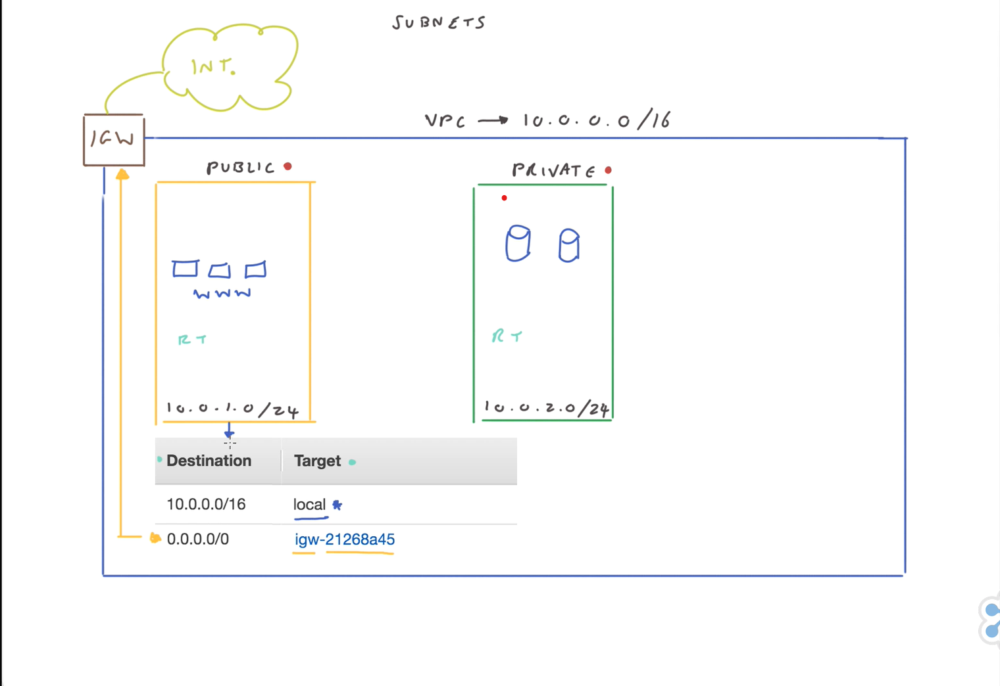

# ☁️ Amazon VPC (Virtual Private Cloud) Overview  

## 🧩 Definition
**Amazon VPC** is an **isolated segment** within the AWS Cloud that provides a **secure and private space** for deploying resources such as **compute, storage, and databases**.  

- By default, only the **AWS account that creates the VPC** has access, ensuring **complete isolation** from other VPCs.  
- Each AWS account can create up to **5 VPCs per region**.  
- A VPC requires a **name** and an **IP address range** defined by a **CIDR block**.  
- VPCs support both **public and private subnets**, with traffic controlled via **network access control lists (NACLs)** and **security groups**.  
- Connectivity to the internet is achieved via **internet gateways** (for public subnets) or **NAT gateways** (for private instances needing internet access).  
- **VPC peering** enables communication between two VPCs (within the same or across different regions) but is **one-to-one**—additional VPCs require separate peering connections.  
- Corporate networks can connect to a VPC using **VPN connections** (over the internet) or **Direct Connect** (private network connection).  
- **Subnets** segment the VPC, aiding in **management, isolation, and high availability**, with each subnet requiring its own **CIDR block** within the VPC range.  

---

## 🧩 Analogy: VPC as a Gated Community  

Imagine a **VPC** as your own personal **gated community** within a large city (the AWS Cloud):  

- 🏡 The community is **exclusively yours**, and you control who can enter and exit, ensuring **privacy and security** for your homes (your data and applications).  
- 🏘️ Inside, there are **various houses and amenities**—compute resources, storage, and databases.  
- 🛡️ Other people have their own gated communities (other customer VPCs), but **they cannot access yours without permission**, guaranteeing **isolation** within the bustling AWS Cloud.  

---

## ⚙️ Key Features and Characteristics  

- 🌐 **Isolated Network Environment** – Complete isolation from other VPCs by default.  
- 🏷️ **CIDR-Based IP Range** – Each VPC requires a **CIDR block** to define its network.  
- 🗂️ **Subnets** – Segment resources into **public** and **private** subnets.  
- 🔒 **Security Control** – Network traffic controlled via **NACLs** and **security groups**.  
- 🌍 **Internet Connectivity** – Public subnets connect via **internet gateways**, private subnets via **NAT gateways**.  
- 🔗 **VPC Peering** – Enables communication between VPCs (**one-to-one connection**).  
- 🏢 **Hybrid Connectivity** – Connect corporate networks using **VPNs** or **Direct Connect**.  
- 📊 **High Availability & Segmentation** – Subnets and multiple AZs allow for resilient architecture.  
- 📈 **Regional Limits** – Maximum **5 VPCs per region** per account (default).

---

# 🌐 Subnets in Amazon VPC  

## 🧩 Definition  
**Subnets** are **segments within a Virtual Private Cloud (VPC)** that enable **organization, segmentation, and isolation** of AWS resources.  
They can be classified as **public** or **private**, depending on their configuration and connectivity to the internet.  

- **Public Subnets** are accessible from outside the VPC (i.e., the Internet).  
  - Typically host **web servers** or other resources that require public access.  
  - Each resource in a public subnet has both an **internal IP address** and a **public IP address**.  
  - To make a subnet public, two configurations are required:  
    1. Attach an **Internet Gateway (IGW)** to the VPC.  
    2. Add a **route** to the subnet’s **route table** that directs traffic to the IGW.  
  - The **Internet Gateway** acts as a bridge between the VPC and the Internet, allowing inbound and outbound traffic.  

- **Private Subnets** are **not directly accessible** from the Internet.  
  - Typically host **backend services** like databases or application servers.  
  - By default, subnets are **private** until an Internet Gateway is attached and routing is configured for public access.  
  - Resources in private subnets **do not have public IP addresses**, which enhances security by preventing external access.  
  - To enable Internet access **outbound only**, a **NAT Gateway** can be used.  
    - The NAT Gateway resides in a **public subnet**.  
    - It uses a **public IP address** to route outbound traffic from private subnets to the Internet while keeping inbound traffic blocked.  

- **Routing**:  
  - Public subnets use route tables with **default routes to the IGW**.  
  - Private subnets use route tables that keep traffic **within the VPC** or **route outbound via a NAT Gateway**.  

- **Security**:  
  - Both subnet types rely on **Security Groups** and **Network Access Control Lists (NACLs)** to manage inbound and outbound traffic rules.  

---

---

## 🧩 Analogy: Subnets as Rooms in Your Home Network  

Imagine your **home network** as a **VPC (Virtual Private Cloud)**, and your **rooms** as **subnets**:  

- 🏠 Each room (subnet) serves a specific purpose — like a **living room**, **kitchen**, or **bedroom** — and contains devices (resources) such as a TV, fridge, or lamp.  
- 🌐 Your home’s **Wi-Fi router** acts as the **Internet Gateway**, controlling who connects from the outside world.  
- 🚪 **Public Subnets** are like your **living room**, where **guests** are allowed — accessible from the outside.  
- 🔒 **Private Subnets** are like your **bedroom**, where only **family members (trusted traffic)** can enter.  
- ⚙️ You can define rules about who can access which room (using **Security Groups** and **NACLs**).  
- 🔁 A **NAT Gateway** acts like a **secured hallway** that lets you go out to the Internet from private rooms, but no one can come in directly.  

This setup ensures a **balance of accessibility and security**, just like how subnets organize and protect resources inside a VPC.  

---

## ⚙️ Key Features and Characteristics  

- 🧱 **Segmentation** – Subdivide a VPC into smaller, logical network sections.  
- 🌍 **Public Subnets** – Allow inbound/outbound Internet access via an **Internet Gateway**.  
- 🔒 **Private Subnets** – Isolated from direct Internet access for sensitive resources.  
- 🔄 **NAT Gateway** – Enables outbound Internet access from private subnets while blocking inbound traffic.  
- 🗺️ **Routing Tables** – Define how traffic flows between subnets and external networks.  
- 🛡️ **Security Controls** – Use **Security Groups** and **NACLs** to regulate access.  
- 🧭 **Default Behavior** – Subnets are **private by default** until configured otherwise.  
- ⚡ **High Availability** – Deploy subnets across multiple **Availability Zones** for redundancy.  

---

## 🧩 Reserved IP Addresses in a Subnet  

In each subnet, **certain IP addresses are reserved** and **cannot be assigned** to host resources. Specifically, **the first four IP addresses** and **the last IP address** in any subnet are reserved for AWS networking purposes.  

| IP Address | Purpose | Usable for Hosts? |
|-------------|----------|------------------|
| 1st | **Network Address** – identifies the subnet itself | ❌ |
| 2nd | **AWS Routing** – reserved by AWS for internal routing | ❌ |
| 3rd | **DNS** – reserved for Amazon DNS server | ❌ |
| 4th | **Future Use** – reserved by AWS | ❌ |
| Last | **Broadcast Address** – reserved for broadcast traffic | ❌ |

As a result, in a **/24 CIDR block**, which provides **256 IP addresses**, only **251 are available** for host resources.  