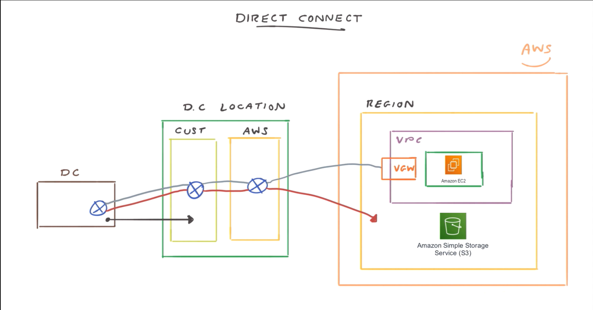

# 🌐 Virtual Private Network (VPN)

## 🧩 Definition  
A **Virtual Private Network (VPN)** is a **secure communication channel** that connects **two remote networks** over the **internet**.  
In AWS, VPNs enable private and encrypted connectivity between an **on-premises data center** (or office network) and an **Amazon Virtual Private Cloud (VPC)**.

This connection ensures that data transmitted between your data center and AWS remains **confidential and protected**, even though it travels across the public internet.

---

## 🏗️ Architecture Overview  

A typical **AWS VPN setup** involves two main components:  

1. **Virtual Private Gateway (VGW)** –  
   - Deployed on the **AWS side** of the connection.  
   - Attached to your **VPC**, similar to how an Internet Gateway (IGW) connects the VPC to the internet.  

2. **Customer Gateway (CGW)** –  
   - Deployed on the **on-premises side** of the connection.  
   - Can be a **hardware device** (e.g., Cisco, Juniper router) or a **software-based VPN appliance**.  

Together, they establish a **VPN tunnel** between AWS and your corporate network.

---

## 🔐 Key Features  

- **Encrypted Tunnel:**  
  All traffic between the **Virtual Private Gateway** and the **Customer Gateway** is **encrypted**, ensuring confidentiality and integrity.  

- **Secure Connectivity Over the Internet:**  
  Although VPNs use the public internet, the communication remains private and tamper-proof.  

- **Static or Dynamic Routing:**  
  - **Static Routing:** You manually define routes between the networks.  
  - **Dynamic Routing (via BGP):** Enables automatic route exchange and **route propagation** in AWS route tables.  

- **High Availability:**  
  AWS automatically sets up **two VPN tunnels** for redundancy — if one fails, the other continues traffic flow seamlessly.  

- **Configurable Security:**  
  Security groups and NACLs can be customized to allow only necessary protocols and ports between the VPC and the on-premises network.  

---

## 🧠 How It Works  

1. A **Virtual Private Gateway (VGW)** is created and **attached** to your VPC.  
2. A **Customer Gateway (CGW)** is configured in your data center or network.  
3. AWS establishes an **IPsec VPN tunnel** between the VGW and CGW.  
4. Route tables in your VPC are updated — manually or automatically via **route propagation** — to direct traffic through the VPN.  
5. Data flows securely between your on-premises network and AWS over the encrypted tunnel.  

---

---

## 🧩 Analogy: The Private Tunnel Between Home and Office  

Imagine your **home** represents your **corporate network**, and your **office** represents your **AWS VPC**.  
You want to travel between the two locations, but the **internet (public roads)** is full of people who could see or intercept your route.  

So, you build a **private underground tunnel** 🚇 that only you can use.  

- This tunnel is **secure and private** — no one else can see you or your belongings (encrypted traffic).  
- The **entry at your home** is your **Customer Gateway (CGW)**, and the **exit at your office** is the **Virtual Private Gateway (VGW)**.  
- When you travel through this tunnel, you’re connected to your office network as if you were physically there.  

That’s exactly how a **VPN connection** functions — it securely connects two distant locations through a **protected, encrypted pathway** across the internet.

---

## ⚙️ Best Practices  

- 🧱 **Use Dynamic Routing (BGP)** when possible for simplified route management and failover.  
- 🕵️ **Monitor VPN connections** using **Amazon CloudWatch** for latency, packet loss, and tunnel status.  
- 🔐 **Restrict access** with proper security group and NACL configurations.  
- 🌍 **Use multiple VPN connections** across **different Availability Zones** for redundancy.  
- 🧩 **Consider AWS Direct Connect** for dedicated, higher bandwidth, and lower latency private connections when VPN isn’t sufficient.  

---

## 🌍 Summary  

| Feature | Description |
|----------|-------------|
| **Purpose** | Securely connects on-premises networks to AWS over the internet |
| **Connection Type** | Encrypted IPsec tunnel |
| **Components** | Virtual Private Gateway (AWS side), Customer Gateway (on-premises side) |
| **Routing Options** | Static or Dynamic (BGP) |
| **Redundancy** | Two VPN tunnels by default |
| **Security** | Encryption in transit, configurable access controls |

---

# 🚄 AWS Direct Connect

## 🧩 Definition  
**AWS Direct Connect** is a **dedicated, private network connection** between your **on-premises data center** and **AWS**.  
Unlike a **VPN**, which transmits traffic over the public internet, Direct Connect provides a **secure, stable, and high-performance** pathway directly into AWS infrastructure.  

This private link minimizes latency, improves bandwidth performance, and enhances security — ideal for enterprises with heavy data transfer needs or strict compliance requirements.

---

## 🏗️ Connection Architecture  

An AWS Direct Connect setup typically involves three main components. The connection involves a middle entity, typically an AWS partner or customer, that manages the Direct Connect infrastructure:

1. **Customer Router (On-Premises)** – Located within your organization’s data center.  
2. **AWS Router (Direct Connect Location)** – Managed by AWS in a specialized facility separate from your data center.  
3. **Connection Partner (Carrier or AWS Partner Network)** – Provides the physical connectivity between your data center and AWS’s Direct Connect location.  

🧩 **Flow Overview:**  
Your on-premises router connects to the **AWS router** in a **Direct Connect location** via a **dedicated fiber link**, bypassing the internet entirely.  

---

**Connects to an AWS Region**

---

## 🌐 Virtual Interfaces (VIFs)  

Direct Connect supports **two types of virtual interfaces**, depending on your access needs:

| Virtual Interface | Purpose | Example Use |
|-------------------|----------|--------------|
| **Private VIF** | Connects your on-premises network directly to your **VPC**, enabling access to **private AWS resources** such as EC2 instances or RDS databases. | Secure workloads that require private IP communication. |
| **Public VIF** | Connects your network to **public AWS endpoints** across regions, such as **Amazon S3**, **DynamoDB**, or **SNS**. | Accessing global AWS services securely without using the internet. |

💡 You can create multiple VIFs on a single Direct Connect connection for flexibility and isolation.

---

## ⚡ Performance and Speed  

- Offers **high-speed connections** ranging from **1 Gbps** to **10 Gbps**, with options for **100 Gbps** in select regions.  
- Provides **consistent network performance** with **lower latency** and **higher reliability** than internet-based VPNs.  
- Ideal for **data-intensive workloads** such as backups, analytics, and real-time applications.  

---

## 🧩 Analogy: The Private Train Line  

Imagine you usually travel from your **home (on-premises data center)** to your **favorite holiday destination (AWS region)** using **public buses (the internet)**.  
These buses are **crowded**, **slow**, and **shared**, meaning delays and unpredictability are common.  

Now, with **Direct Connect**, you have access to your own **private, high-speed train line** 🚄 — no stops, no other passengers, and a **dedicated track** just for you.  

- The **train line** represents your **dedicated Direct Connect link**.  
- You can access **private villas (private VPC resources)** or **public attractions (AWS public services)** seamlessly.  
- The journey is **faster**, **safer**, and **more reliable** than using public transport.  

This is the core benefit of **Direct Connect** — a **dedicated, high-performance route** to AWS that avoids the congestion and risks of the public internet.

---

## 🧰 Integration with AWS Services  

Direct Connect can integrate with other AWS networking components to build complex, scalable architectures:

- 🌉 **VPC Peering:** Enables communication between multiple VPCs connected via Direct Connect.  
- 🌐 **Transit Gateway:** Centralizes network management and connects multiple VPCs and on-premises networks using a single Direct Connect link.  
- 🔍 **CloudWatch Integration:** Monitors connection health, throughput, and latency for proactive management.  

---

## 💼 Use Cases  

| Scenario | Description |
|-----------|-------------|
| **Hybrid Cloud Architecture** | Connect on-premises applications directly to AWS workloads securely and efficiently. |
| **High-Performance Data Transfers** | Ideal for transferring large datasets, such as backups or analytics workloads. |
| **Compliance & Security Requirements** | Ensures data never traverses the public internet, helping meet strict compliance needs. |
| **Low-Latency Applications** | Suitable for real-time applications that require consistent, high-speed network performance. |

---

## ⚙️ Key Advantages  

- 🔒 **Enhanced Security** – Traffic bypasses the internet entirely.  
- ⚡ **Consistent Performance** – Dedicated bandwidth and low latency.  
- 📈 **Scalability** – Supports high-speed data throughput.  
- 🧩 **Integration Ready** – Works with VPCs, Transit Gateway, and AWS services.  
- 💰 **Predictable Costs** – Data transfer costs are typically lower than over the public internet.  

---

## 🌍 Summary  

| Feature | Description |
|----------|-------------|
| **Connection Type** | Dedicated private network link (bypasses internet) |
| **Speed** | 1 Gbps – 10 Gbps (up to 100 Gbps in some regions) |
| **Virtual Interfaces** | Private (VPC access) & Public (AWS services access) |
| **Security** | Encrypted, private link – not exposed to the public internet |
| **Integration** | Compatible with Transit Gateway and VPC Peering |
| **Best For** | Enterprises needing secure, reliable, high-performance AWS connectivity |