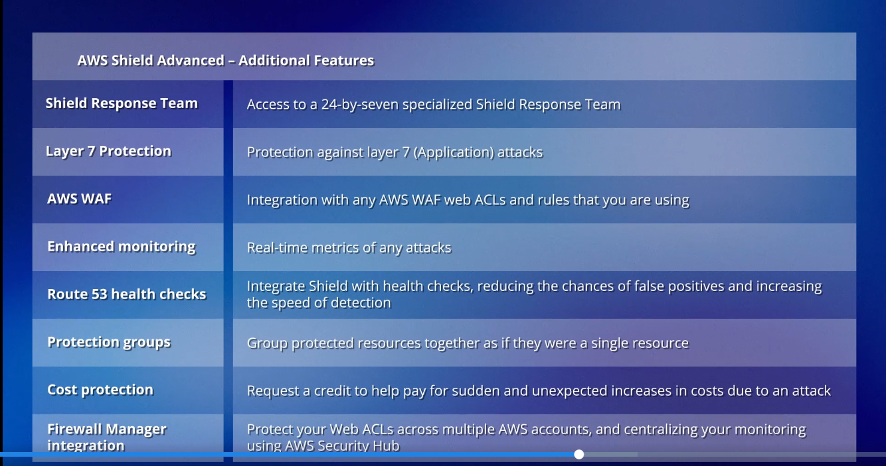

# 🛡️ AWS Shield Overview

## 🧩 Definition

**AWS Shield** is a managed service designed to protect AWS applications and resources from **Distributed Denial of Service (DDoS) attacks**.

AWS Shield automatically detects threats that could impact your environment.

---

## 🔗 Integration with Other Services

AWS Shield integrates closely with:

- 🛡️ **AWS WAF**
- 🛡️ **AWS Firewall Manager**

Together, these services provide comprehensive protection against DDoS and web-based threats.

---

## 🌐 DDoS Attack Detection

AWS Shield can detect DDoS attacks across different layers of the **OSI model**.

### 🌐 Layer 3 — Network

Targets:

- 🌊 Network bandwidth.
- 📡 Network capacity.

With erroneous network traffic.

---

### 🚚 Layer 4 — Transport

Focuses adding on weaknesses in network protocols.

Example:

- 🌊 **SYN Flood Attacks**
- **Reflection Attacks**

The aim here is to both consumers and deplete the reources available which then prevents legitimate traffic from being serviced by the resource.

---

### 🖥️ Layer 7 — Application

Involves **HTTP/S request floods** that target web applications.

---

## 🛡️ AWS Shield Protection Levels

AWS Shield provides two protection levels:

- 🆓 **AWS Shield Standard**
- 🛡️ **AWS Shield Advanced**

---

## 🆓 AWS Shield Standard

**AWS Shield Standard** is free for all AWS accounts.

It provides basic protection against common:

- 🌐 **Layer 3 attacks**
- 🚚 **Layer 4 attacks**

Shield Standard integrates with:

- ☁️ **Amazon CloudFront**
- 🌐 **Amazon Route 53**
- 🚀 **AWS Global Accelerator**

---

## 🛡️ AWS Shield Advanced

**AWS Shield Advanced** provides enhanced protection for a wider range of AWS services.

It protects resources such as:

- 🖥️ **Amazon EC2**
- 🌐 **Elastic IPs**
- ☁️ **Amazon CloudFront**
- And more.

Shield Advanced provides additional protection and monitoring capabilities.

### 💰 Cost

AWS Shield Advanced requires a subscription costing:

> **$3,000 per month**

The subscription has a:

> **12-month minimum commitment**

---

## 🆚 AWS Shield Standard vs Shield Advanced

| Feature | 🆓 Shield Standard | 🛡️ Shield Advanced |
|---|---|---|
| Cost | Free | $3,000/month |
| Commitment | None | 12-month minimum |
| Layer 3 Protection | ✅ | ✅ |
| Layer 4 Protection | ✅ | ✅ |
| Layer 7 Protection | ❌ | ✅ |
| CloudFront | ✅ | ✅ |
| Route 53 | ✅ | ✅ |
| Global Accelerator | ✅ | ✅ |
| EC2 | ❌ | ✅ |
| Elastic IPs | ❌ | ✅ |
| Shield Response Team | ❌ | ✅ |
| Enhanced Monitoring | ❌ | ✅ |
| Cost Protection | ❌ | ✅ |

---

## 🚨 Shield Response Team

The **Shield Response Team (SRT)** provides specialized support for managing **DDoS attacks**.

This provides access to experts who can assist with DDoS attack events.

---

---

## ✨ Features

- 🛡️ Protects AWS applications and resources against DDoS attacks.
- 🤖 Automatically detects threats.
- 🌐 Detects Layer 3 attacks.
- 🚚 Detects Layer 4 attacks.
- 🖥️ Detects Layer 7 attacks.
- 🆓 Provides free protection with Shield Standard.
- 🛡️ Provides enhanced protection with Shield Advanced.
- 🚨 Provides access to the Shield Response Team with Shield Advanced.
- 📊 Provides enhanced monitoring.
- ❤️ Integrates with Route 53 Health Checks.
- 🛡️ Supports Protection Groups.
- 💰 Provides Cost Protection.
- 🏢 Integrates with AWS Firewall Manager.

---

## 🎯 Use Cases

- 🛡️ Protecting AWS resources against DDoS attacks.
- 🌐 Protecting against Layer 3 network attacks.
- 🚚 Protecting against Layer 4 transport attacks.
- 🖥️ Protecting web applications against Layer 7 attacks.
- ☁️ Protecting CloudFront distributions.
- 🌐 Protecting Route 53 resources.
- 🚀 Protecting AWS Global Accelerator resources.
- 🖥️ Protecting EC2 resources with Shield Advanced.
- 🔐 Protecting Elastic IPs with Shield Advanced.
- 🏢 Managing DDoS protection across multiple AWS accounts.

---

## ⚖️ Key Benefits

- 🛡️ Provides managed DDoS protection.
- 🤖 Automatically detects DDoS threats.
- 🌐 Protects against attacks across multiple OSI layers.
- 🆓 Provides basic DDoS protection at no additional cost with Shield Standard.
- 🛡️ Provides enhanced protection with Shield Advanced.
- 🚨 Provides specialized DDoS support through the Shield Response Team.
- 📊 Provides enhanced visibility into DDoS events.
- ❤️ Helps improve attack detection through Route 53 Health Checks.
- 🛡️ Allows resources to be grouped for collective protection.
- 💰 Helps reduce unexpected scaling costs caused by DDoS attacks.
- 🏢 Supports centralized protection across multiple AWS accounts through Firewall Manager.

---

## 🧠 Analogy: AWS Shield as a House Security System

Imagine your **AWS resources** are like a **house in a neighborhood**.

Just as you would install a **security system** to protect your house from burglars or vandals, **AWS Shield** acts as a security system for your cloud environment.

The security system constantly monitors for **unwanted visitors**, such as cyber attackers attempting to break in with **Distributed Denial of Service (DDoS) attacks**.

If someone tries to flood your house with unwanted guests to overwhelm it:

- 🏠 **Your House** = AWS Resources
- 🛡️ **Security System** = AWS Shield
- 👤 **Unwanted Visitors** = Cyber Attackers
- 🌊 **Flood of Unwanted Guests** = DDoS Attack
- 🚫 **Blocking Intruders** = DDoS Protection

AWS Shield steps in to help **block the intruders and keep your cloud environment safe and running smoothly**.

This allows you to focus on your daily activities without worrying about these threats.