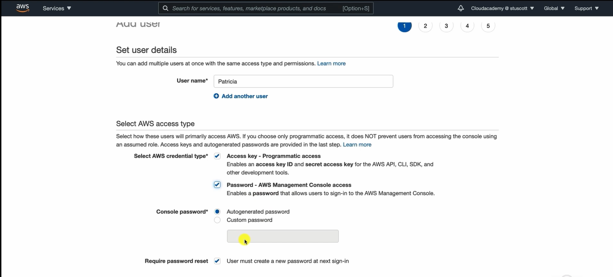

# 👤 Creating an AWS IAM User

## 🧩 Definition

An **IAM User** can be created to provide an identity with access to AWS resources.

Users can be created using several methods, including:

- 🖥️ AWS Management Console
- 💻 AWS CLI
- ⚡ PowerShell
- 🌐 IAM HTTP API

This section focuses on creating a user through the **AWS Management Console**.

---

## 📝 Step 1: Configure User Details

The first step is to configure the user's basic information.

This includes:

- 👤 Choosing a **username** can be up to 64 characters long.
- 🔐 Selecting the type of access the user will have.

---

## 🔑 Step 2: Select Access Type

When creating a user, one or both access types can be selected.

### 🖥️ AWS Management Console Access

Allows the user to sign in to the **AWS Management Console**.

Console access requires:

- 🔑 Setting a password for the user.

---

### 💻 Programmatic Access

Allows the user to access AWS resources programmatically.

When enabled, AWS generates:

- 🆔 Access Key ID
- 🔐 Secret Access Key

These credentials are used for programmatic authentication.

---

---

## 🛂 Step 3: Assign Permissions

Permissions determine what the user can access within AWS.

Permissions can be assigned by:

- 📜 Attaching policies directly to the user.
- 👥 Adding the user to one or more IAM User Groups.

A **Permission Boundary** can also be configured to define permission limits.

---

## 🏷️ Step 4: Add Tags

Tags can be assigned to IAM users just like other AWS resources.

Tags help organize and identify users.

---

## ✅ Step 5: Review and Create

After reviewing the configuration, the IAM user is created.

Once created:

- 📥 Security credentials can be downloaded as a **CSV file**.

---

## 🔐 Download Security Credentials

For users with **Programmatic Access**, AWS provides:

- 🆔 Access Key ID
- 🔑 Secret Access Key

> **Important:** The **Secret Access Key is only displayed once** during user creation.

It is important to download and securely store these credentials because they cannot be viewed again later.

---

## ✨ Features

- 👤 Create IAM users through multiple AWS interfaces.
- 🖥️ Support AWS Management Console access.
- 💻 Support Programmatic Access.
- 📜 Assign permissions using policies or groups.
- 🛂 Configure Permission Boundaries.
- 🏷️ Apply tags to users.
- 📥 Download user security credentials after creation.

---

## 🎯 Use Cases

- 👤 Creating identities for individuals requiring AWS access.
- 💻 Providing applications with programmatic access credentials.
- 👥 Assigning users to groups for simplified permission management.
- 🏷️ Organizing users using tags.
- 🔐 Controlling user permissions through policies and permission boundaries.

---

## ⚖️ Key Benefits

- 👤 Provides a structured process for creating IAM users.
- 🔑 Supports both console and programmatic access.
- 👥 Simplifies permission management through groups and policies.
- 🏷️ Allows user organization using tags.
- 📥 Provides downloadable security credentials during user creation.
- 🔐 Encourages secure handling of access keys by emphasizing their one-time availability.

---

## 🧠 Analogy: Creating an Employee Account

Imagine creating an **IAM User** as **onboarding a new employee** at a company.

- 👤 The **username** is the employee's name in the company directory.
- 🖥️ **Console Access** is giving the employee a badge to enter the office.
- 💻 **Programmatic Access** is issuing special keys that allow company software to perform work on the employee's behalf.
- 👥 **Groups** determine which departments the employee belongs to.
- 📜 **Policies** define what areas the employee can access.
- 🏷️ **Tags** act like labels that help identify the employee.
- 📥 The **Access Key ID** and **Secret Access Key** are like confidential credentials that are handed to the employee only once and should be stored securely.

Creating an IAM user ensures the right identity is configured with the appropriate access and permissions.