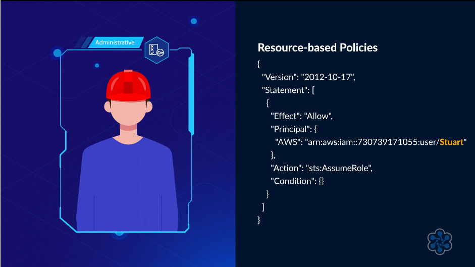

# 📜 IAM AWS Policy Types

## 🧩 Definition

**AWS IAM Policies** define permissions and control access to AWS resources.

There are four main types of IAM policies:

- 👤 **Identity-Based Policies**
- 🗄️ **Resource-Based Policies**
- 🚧 **Permission Boundaries**
- 🏢 **Service Control Policies (SCPs)**

---

## 1. 👤 Identity-Based Policies

**Identity-Based Policies** are attached to:

- 👤 IAM Users
- 👥 IAM User Groups
- 🎭 IAM Roles

They define and control the permissions each of these entities has. They can be either managed or inline policies.

Identity-based policies can be either:

- 📚 **Managed Policies**
- 📝 **Inline Policies**

---

## 📚 Managed Policies

**Managed Policies** These are stored in the **IAM library** and can be attached to multiple entities. They come in two types

Managed policies can be:

- ☁️ **AWS Managed Policies** - Pre-configured by AWS to manage common permissions.
- 👤 **Customer Managed Policies** - Created by users to meet specific security requirements, offering more granularity.

Because managed policies are reusable, they can be used with multiple entities.

---

## 📝 Inline Policies

**Inline Policies** Embedded directly into a specific user, user group, or role, and not stored in the IAM library. They create a one-to-one relationship and are used when specific permissions should not be mistakenly assigned to others.

Unlike managed policies, inline policies are not reusable across multiple entities.

They are directly associated with the specific:

- 👤 User
- 👥 User Group
- 🎭 Role

---

## 2. 🗄️ Resource-Based Policies

**Resource-Based Policies** are policies that are directly associated with **AWS resources** rather than identities.

They are attached to resources such as:

- 🪣 **Amazon S3 Buckets**
- ☁️ Other AWS resources

Resource-based policies define:

- 👤 **Who** can access the resource (**Principal**).
    - Principal = WHO is trying to access something? It can be:
        - 👤 IAM User — a specific AWS user
        - 🎭 IAM Role — a role that can be assumed
        - ⚙️ AWS Service — an AWS service acting on your behalf
        - 🌐 Federated User — a user authenticated through an external identity provider
- 🔐 **What actions** the principal can perform.
- 🚫 Which actions can be allowed or denied.

---

## 👤 Principal Parameter

The **Principal** parameter is a crucial part of resource-based policies.

It specifies **which identity or identities** the policy permissions apply to.

Unlike **identity-based policies**, resource-based policies **must include the Principal parameter** to determine which identities are allowed or denied access to the resource.

---

## 🪣 Example: S3 Bucket Policy

A common example of a resource-based policy is an **S3 Bucket Policy**.

An S3 bucket policy can control:

- 👤 Who can access the bucket.
- 🔐 What actions they can perform.
- 🚫 Which actions are denied.
- 🪣 Access to the bucket and its contents.

Resource-based policies are written in **JSON** and can be customized to allow or deny specific actions for specified principals.

---

## 🤝 IAM Role Trust Relationships

**Trust Relationship policies** in IAM Roles are also a type of **resource-based policy**.

The Trust Relationship defines:

- 👤 Which **Principal** is trusted.
- 🎭 Which Principal is allowed to **assume the IAM Role**.

This determines who or what can assume the role and obtain its permissions.

---

## 🆚 Resource-Based vs Identity-Based Policies

| Feature | Resource-Based Policies | Identity-Based Policies |
|---|---|---|
| Attached To | AWS Resources | Users, Groups, or Roles |
| Principal Parameter | ✅ Required | ❌ Not included |
| Defines | Who can access the resource and what they can do | What permissions an identity has |
| Example | 🪣 S3 Bucket Policy | 👤 IAM User Policy |
| JSON | ✅ Yes | ✅ Yes |

---

## 3. 🚧 Permission Boundaries

**Permission Boundaries** are a security feature that limits the **maximum level of permissions** a user or role can have.

They act as a **guardrail**, ensuring that even if an identity-based policy grants extensive permissions, the permission boundary restricts access to the defined limits.

Permission boundaries:

- 🚧 Set the maximum permissions for a user or role.
- 🔒 Restrict permissions granted through identity-based policies.
- 🚫 Do not grant permissions themselves.
- 📜 Can be AWS Managed Policies.
- 👤 Can be Customer Managed Policies.

---

## 🛡️ Permission Boundary Example

Imagine a user has identity-based policies that provide:

- 🪣 **Full access to Amazon S3**
- 🖥️ **Full access to Amazon EC2**

A permission boundary is then configured to allow only:

- 📖 **Read-only access to Amazon S3**

The user's effective permissions would be:

- 🪣 **S3:** Read-only access.
- 🖥️ **EC2:** Full access.

The permission boundary limits the user's maximum S3 permissions even though the identity-based policy provides full S3 access.

---

## 4. 🏢 Service Control Policies (SCPs)

**Service Control Policies (SCPs)** are used within **AWS Organizations** to define the **maximum permissions** allowed for AWS accounts or **Organizational Units (OUs)**.

SCPs act as a **boundary**, setting limits on what actions can be performed.

SCPs:

- 🔒 Define the maximum permissions allowed.
- 🚫 Do not grant permissions themselves.
- 🏢 Apply to AWS accounts or Organizational Units (OUs).
- 👥 Affect all members of the associated account or OU.

---

## ⚠️ SCPs and Other Policies

**SCPs take precedence over identity-based and resource-based policies.**

For example:

- 👤 A user has **full access to Amazon S3** through an identity-based policy.
- 🚫 An SCP denies access to Amazon S3.
- 🪣 The user will be **unable to access Amazon S3**.

The SCP restricts the maximum permissions available even if another policy grants access.

---

## ⚙️ SCP Requirements

To use **Service Control Policies (SCPs)**:

- 🏢 **AWS Organizations** must be deployed.
- ⚙️ The **"Enable All Features"** setting must be enabled.
- 🌳 SCPs must be enabled from the **root account** of the organization.
- 🏢 SCPs are managed through the **AWS Organizations console**.
- 🚫 SCPs are not managed through IAM.

---

## 🗂️ SCPs and Organizational Units

SCPs can be used with **Organizational Units (OUs)** to impose additional restrictions.

This allows organizations to apply specific security restrictions to groups of AWS accounts.

For example, additional restrictions can be applied to accounts handling **sensitive workloads**.

---

## 🌐 Multi-Account Security

SCPs are useful for managing security at the **account level**, especially in **multi-account environments**.

They can:

- 🏢 Apply security restrictions across AWS accounts.
- 🗂️ Apply additional restrictions to Organizational Units.
- 🔒 Limit the maximum permissions available to accounts.
- 🛡️ Enhance security for accounts handling sensitive workloads.

---

## 🧪 Testing SCPs

SCPs should be **tested before applying them to large sets of accounts**.

Testing helps ensure that the restrictions do not prevent required actions across affected accounts or Organizational Units.

---

## 🆚 IAM Policy Types

| Policy Type | Attached To | Purpose | Grants Permissions? |
|---|---|---|---|
| 👤 Identity-Based Policies | Users, Groups, Roles | Control identity permissions | ✅ Yes |
| 🗄️ Resource-Based Policies | AWS Resources | Define which principals can access a resource | ✅ Yes |
| 🚧 Permission Boundaries | Users or Roles | Set maximum permissions | ❌ No |
| 🏢 Service Control Policies (SCPs) | AWS Accounts or Organizational Units | Define maximum permissions | ❌ No |

---

## ✨ Features

- 👤 Identity-Based Policies control permissions for users, groups, and roles.
- 📚 Managed Policies are reusable and stored in the IAM policy library.
- 📝 Inline Policies are specific to an individual entity.
- 🗄️ Resource-Based Policies are attached directly to resources.
- 🎯 Resource-Based Policies use a **Principal** parameter.
- 🚧 Permission Boundaries define maximum permissions.
- 🏢 SCPs define maximum permissions at the AWS account or organizational unit level.
- 🔒 SCPs restrict access without granting permissions.

---

## 🎯 Use Cases

- 👤 Controlling permissions for IAM users, groups, and roles.
- 📚 Reusing managed policies across entities.
- 📝 Creating policies specific to an individual entity with inline policies.
- 🪣 Controlling access to resources using resource-based policies.
- 🚧 Limiting the maximum permissions available to users or roles.
- 🏢 Restricting permissions across AWS accounts and organizational units using SCPs.

---

## ⚖️ Key Benefits

- 🔐 Provides detailed control over AWS permissions.
- 📚 Allows policies to be reused through managed policies.
- 📝 Allows entity-specific permissions through inline policies.
- 🗄️ Allows resources to define which principals can access them.
- 🚧 Limits the maximum permissions available to users and roles.
- 🏢 Allows AWS Organizations to restrict permissions across accounts and organizational units.
- 🔒 Helps prevent identities from exceeding defined permission boundaries or organizational restrictions.