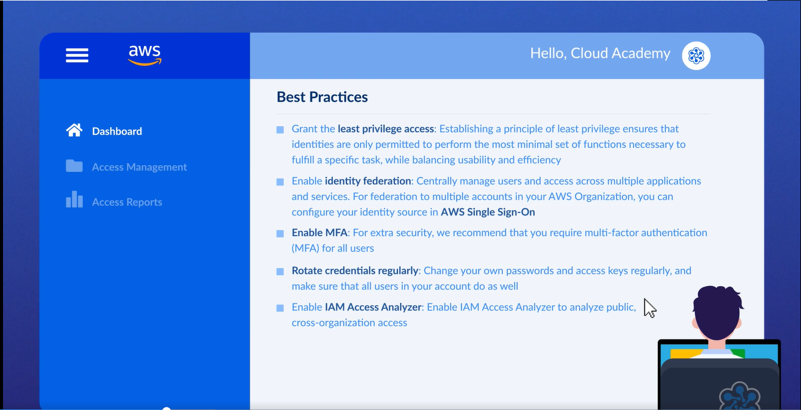

# 🛡️ AWS Identity and Access Management (IAM) Components Overview  

## 🧩 Definition
**AWS Identity and Access Management (IAM)** is essential for maintaining **security and control over access to AWS resources**.  

IAM allows organizations to define access control procedures based on their security standards, including:

- 🔑 Password policies.
- 📱 Multi-Factor Authentication (MFA).
- 🛂 Access permissions and controls.

IAM helps ensure that users, services, and applications receive the appropriate level of access.

---

## 🛡️ IAM Security and Access Control  

IAM is used to establish security procedures that control how identities access AWS resources.

Organizations can define:

- 🔐 **Password Policies**
  - Establish rules for user passwords based on security requirements.

- 📱 **Multi-Factor Authentication (MFA)**
  - Adds an additional security layer to user authentication.

These controls help maintain secure access management within an AWS environment.

---

## 🖥️ AWS Management Console IAM Dashboard  

The AWS Management Console provides an **IAM Dashboard** located under:

- **Security, Identity & Compliance**

The IAM Dashboard provides:

- 📊 A summary of IAM resources.
- ✅ IAM security best practices.

---

# 🧩 IAM Components  

IAM consists of four primary components:

- 👤 Users
- 👥 User Groups
- 🎭 Roles
- 📜 Policies

Each component serves a different purpose in managing access and permissions.

---

## 👤 IAM Users  

**Users** represent identities used for authentication within AWS.

Users are responsible for:

- 🆔 Representing an individual identity.
- 🔐 Authenticating into AWS.
- 🛂 Receiving permissions through assigned policies.

---

## 👥 IAM User Groups  

**User Groups** are collections of IAM users that authorize access through associated policies.

User Groups:

- 👥 Organize multiple users together.
- 📜 Apply permissions through attached policies.
- 🛂 Simplify access management.

---

## 🎭 IAM Roles  

**Roles** provide temporary permissions for users, services, or applications without being tied to a single person.

Roles are used for:

- 👤 Users requiring temporary access.
- ⚙️ AWS services needing permissions.
- 🖥️ Applications requiring access to AWS resources.

Unlike users, roles do not represent a specific individual.

---

## 📜 IAM Policies  

**Policies** define access permissions within AWS.

Policies:

- 📝 Are written using **JSON format**.
- 🔐 Specify what actions can be performed on resources.
- 🛂 Control authorization.

IAM policies can be:

### 📦 Managed Policies
- Reusable policies that can be applied to multiple identities.

### 📄 Inline Policies
- Policies directly associated with a specific identity.

---

## Password Policy

**Password Policy** allows to enforce the minimum security requirements that need to be met for any password standards.

---

## 🌐 Identity Providers (Federated Access)

**Federated Access** allows external credentials to authenticate and access AWS resources.

Benefits include:

- 🔐 Reducing the need to create individual IAM user accounts.
- 🌍 Allowing external users to securely access AWS resources.
- E.g. you could establish a trust between AWS account and Google account.

---

## ⏳ AWS Security Token Service (STS)  

**AWS Security Token Service (STS)** provides temporary credentials for accessing AWS resources.

STS allows:

- 🔑 Temporary authentication credentials.
- 🛂 Temporary access permissions.

Security recommendations include:

- 🔒 Deactivating unused AWS regions to improve security.

---

## 📊 IAM Access Reports  

IAM provides access reporting features to analyze security and permissions.

### 🔍 Access Analyzer
- Identifies and flags external access to AWS resources.

### 📋 Credential Reports
- Provide details about user credentials.

These reports help organizations monitor and improve access security.

---

## 🏢 Service Control Policies (SCPs)  

**Service Control Policies (SCPs)** are used within **AWS Organizations** to establish permission boundaries for accounts.

SCPs:

- 🛂 Define maximum available permissions for accounts.
- 🚫 Override identity-based policies when necessary.
- 🔐 Provide additional control over account permissions.

---

## ✨ Features  
- 👤 Manage user identities and authentication.
- 👥 Organize users through User Groups.
- 🎭 Provide temporary access through Roles.
- 📜 Define permissions using JSON-based Policies.
- 🌐 Support Federated Access for external users.
- ⏳ Provide temporary credentials through STS.
- 📊 Analyze access using Access Analyzer and Credential Reports.
- 🏢 Control account permissions using Service Control Policies.

---

## 🎯 Use Cases  
- 🔐 Managing access control within AWS environments.
- 👥 Assigning permissions to users and groups.
- ⚙️ Allowing AWS services and applications to securely access resources.
- 🌐 Providing external users secure access without creating individual IAM users.
- 📊 Reviewing access permissions and identifying security issues.
- 🏢 Managing permission boundaries across AWS Organizations.

---

## ⚖️ Key Benefits  
- 🛡️ Provides centralized control over AWS resource access.
- 🔐 Helps organizations enforce security standards.
- 👤 Ensures users receive appropriate permissions.
- ⏳ Enables temporary access without permanent credentials.
- 🌐 Simplifies external user access through Federated Access.
- 📊 Improves visibility through access reports and analysis tools.
- 🏢 Provides additional account-level permission control through SCPs.

---