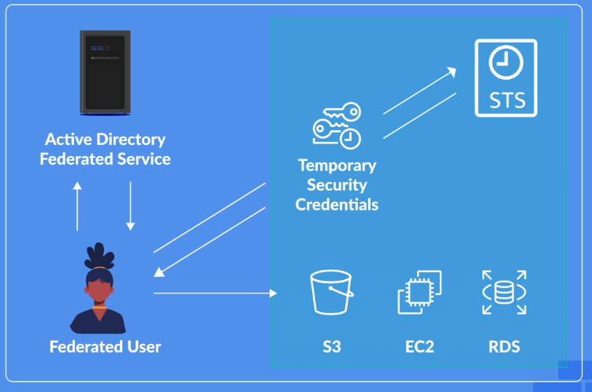

# 🎭 AWS IAM Roles Overview  

## 🧩 Definition
**IAM Roles** provide **temporary credentials** that allow trusted users, AWS services, and applications to access AWS resources.

Unlike **IAM Users**, which represent a single identity, IAM Roles can be assumed by **multiple entities** when access is required.

IAM Roles provide temporary access by generating new credentials for each session instead of using long-term credentials such as passwords or access keys.

---

## 🔐 IAM Roles vs IAM Users  

### 👤 IAM Users
- Represent a **single identity**.
- Use long-term credentials.
- Can have passwords or access keys.

### 🎭 IAM Roles
- Do not represent a single person.
- Can be assumed by multiple trusted entities.
- Provide temporary credentials for each session.

---

## ⏳ Temporary Credentials  

IAM Roles generate temporary credentials that are used during a session.

These credentials:

- 🔑 Are created when a role is assumed.
- ⏱️ Provide temporary access.
- 🚫 Do not require long-term credentials like passwords or access keys.

---

## 📜 Role Policies  

Each IAM Role has associated policies that define access permissions.

Policies determine:

- 🛂 What resources can be accessed.
- 🔐 What actions are allowed or denied.

---

## 🤝 Trust Relationship  

Each IAM Role contains a **Trust Relationship** that defines who or what is allowed to assume the role.

A Trust Relationship determines the trusted entities that can use the role's temporary permissions.

---

## 🌐 IAM Role Access Types  

IAM Roles can be assumed by different entities, including:

### 👤 Users Within the Same AWS Account
- Allows users in the same AWS account to obtain temporary permissions.

### 🔄 Users in Different AWS Accounts
- Enables cross-account access using temporary credentials.

### ⚙️ AWS Services
- Allows AWS services to access resources on behalf of users or applications.

### 🌍 Federated Users
- Allows external users authenticated through systems such as **Active Directory** to access AWS resources.

---

## ✨ Features  

- ⏳ Provides temporary credentials.
- 🔄 Generates new credentials for each session.
- 👥 Supports multiple trusted entities.
- 📜 Uses policies to define permissions.
- 🤝 Uses Trust Relationships to control who can assume roles.
- 🌐 Supports cross-account and federated access.

---

## 🎯 Use Cases  

- 🔐 Granting temporary access to AWS resources.
- 🔄 Allowing cross-account resource access.
- ⚙️ Providing AWS services permission to access resources.
- 🌍 Allowing federated users to access AWS resources.
- 👥 Providing users with temporary permissions without creating long-term credentials.

---

## ⚖️ Key Benefits  

- 🔒 Improves security by avoiding long-term credentials.
- ⏳ Provides temporary access when needed.
- 👥 Allows multiple entities to use the same permissions.
- 🔄 Simplifies access management for users, services, and applications.
- 🌐 Enables secure access across AWS accounts and external identity systems.

---

## 🧠 Analogy: IAM Roles as Temporary Access Badges  

Imagine **IAM Roles** as temporary security badges for a building.

- 👤 An **IAM User** is like a permanent employee badge assigned to one person.
- 🎭 An **IAM Role** is like a temporary visitor badge that can be issued to different trusted visitors when needed.
- ⏳ Each visitor receives a new temporary badge for their visit instead of keeping a permanent badge.
- 📜 The **Role Policy** defines which areas the badge allows access to.
- 🤝 The **Trust Relationship** defines who is allowed to receive the temporary badge.

IAM Roles provide secure temporary access without requiring permanent credentials.

---

# ⚙️ AWS Service Roles to Access AWS Resources on Your Behalf

## 🧩 Definition
**AWS Service Roles** allow **AWS services to assume IAM Roles** so they can access other AWS resources within an AWS account.

Service Roles are commonly used with **Amazon EC2 instances** to allow access to resources such as **Amazon S3** without storing credentials locally.

---

## 🔐 Secure Resource Access with Service Roles  

Assigning an **IAM Role** to an EC2 instance allows the instance to securely access AWS resources.

This eliminates the need to:

- 🔑 Store credentials manually.
- 🗝️ Manage access keys locally.
- ⚠️ Risk exposing long-term credentials.

Instead, the EC2 instance uses the permissions provided by the assigned IAM Role.

---

## ⚙️ Permission Management  

AWS Service Roles simplify permission management by centralizing permissions within the IAM Role.

When permissions are updated:

- 📜 Changes made to the IAM Role automatically apply to all associated EC2 instances.
- 🔄 No manual credential updates are required.

This is different from embedded credentials, where each instance would require individual updates.

---

## 🔗 Service-Linked Roles  

AWS also supports **Service-Linked Roles**, which are IAM Roles created with specific permissions for certain AWS services.

Examples of AWS services that use service-linked roles include:

- ⚙️ AWS Systems Manager
- 📊 AWS CloudTrail
- 📈 Amazon CloudWatch

Service-linked roles:

- 📜 Include pre-configured AWS Managed Policies.
- 🎯 Are designed specifically for individual AWS services.

---

## 🆚 AWS Service Roles vs Service-Linked Roles  

| Feature | AWS Service Roles | Service-Linked Roles |
|---|---|---|
| Purpose | Allow AWS services to access AWS resources | Provide permissions for specific AWS services |
| Policies | Can use AWS Managed or custom policies | Use pre-configured AWS Managed policies |
| Configuration | Can be customized | Designed specifically for a service |
| Usage | General service access | Service-specific access |

**Important**
AWS Service Roles - allow you to apply your own customer managed or AWS managed policies.
AWS Service-Linked Roles - come pre-configured with a specific set of read-only AWS managed policies that can only be used by that particular service.

---

## ✨ Features  

- ⚙️ Allows AWS services to assume IAM Roles.
- 🔐 Provides secure access to AWS resources.
- 🚫 Eliminates the need to store credentials locally.
- 📜 Centralizes permission management.
- 🔄 Automatically applies permission changes to associated resources.
- 🔗 Supports Service-Linked Roles for specific AWS services.

---

## 🎯 Use Cases  

- 🖥️ Allowing EC2 instances to access Amazon S3 resources.
- ⚙️ Granting AWS services permission to perform actions within an account.
- 🔐 Providing secure access without manually managing credentials.
- 📊 Using AWS services such as Systems Manager, CloudTrail, and CloudWatch with predefined permissions.
- 🔄 Managing permissions across multiple associated resources.

---

## ⚖️ Key Benefits  

- 🔐 Improves security by avoiding locally stored credentials.
- ⚙️ Simplifies access management for AWS services.
- ⏱️ Reduces administrative effort by managing permissions centrally.
- 🔄 Automatically updates permissions across associated resources.
- 🛡️ Reduces security risks caused by manually managed credentials.
- 🎯 Provides service-specific permissions through Service-Linked Roles.

---

## 🧠 Analogy: AWS Service Roles vs Service-Linked Roles as Office Access Cards  

Imagine you run a **large office building** with different types of staff access cards.

### ⚙️ Service Roles: Customizable Staff Access Cards

**Service Roles** are like customizable staff access cards where you decide which rooms each card can open.

For example:

- 🧹 You provide the cleaning crew with a card that opens:
  - 🚪 Supply closets.
  - 🚻 Restrooms.

If you want to change their access:

- 🔄 You can update the card's permissions at any time.

Service Roles are:

- 🛠️ Flexible.
- 👤 Managed by you.
- 📜 Configured with permissions that you choose.

---

### 🔗 Service-Linked Roles: Special-Purpose Access Cards

**Service-Linked Roles** are like special-purpose access cards issued by the building management for specific services.

For example:

- 🛗 An elevator maintenance team receives a card that:
  - 🚪 Opens only the doors needed for elevator maintenance.
  - 🔒 Does not provide access to unrelated areas.

These cards:

- 📜 Come pre-programmed with specific permissions.
- 🎯 Are designed for a specific service.
- 🚫 Cannot be modified by you.
- 👤 Can only be used by the intended service.

---

### 🆚 Key Difference

- ⚙️ **Service Roles**
  - Flexible and customizable.
  - Permissions are managed by you.
  - Can use AWS Managed or custom policies.

- 🔗 **Service-Linked Roles**
  - Fixed and purpose-built.
  - Designed for specific AWS services.
  - Use predefined AWS Managed policies.

Service Roles provide **flexible control**, while Service-Linked Roles provide **specific, tightly controlled access for individual AWS services**.

---

# 🔄 Using IAM Roles to Grant Temporary Access for Users

## 🧩 Definition

**IAM User Roles** allow users to obtain **temporary access** to AWS resources by assuming an IAM Role.

Instead of attaching permissions directly to users or user groups, users can assume a role that provides the permissions required to perform a specific task.

This approach provides security benefits by granting users **temporary permissions** only when they are needed.

---

## 🔐 Temporary Access

IAM User Roles allow users to temporarily obtain permissions from an IAM Role.

When a user assumes a role:

- 🔄 Their existing permissions are **temporarily replaced** by the permissions of the role.
- ⏳ The user receives access only for the duration of the role session.
- 🔐 The user can return to their original permissions after completing the task.

---

## ⚙️ How IAM User Roles Work

The process involves:

1. 🎭 **Create an IAM Role**
   - Create a role with the permissions required for the task.

2. 📜 **Define Role Permissions**
   - Attach the necessary policies to the role.

3. 🤝 **Configure the Trust Relationship**
   - Specify which users are allowed to assume the role (aws account).

4. 👤 **Allow the User to Assume the Role**
   - The specified user can switch to the role when access is required.

5. 🔄 **Switch Back**
   - After completing the task, the user can switch back to their original permissions.

---

## 🪣 Example: Amazon S3 Access

A role can be created with **full access to Amazon S3**.

The role can then be configured so that a specific user, such as **Stuart**, is allowed to assume it.

The configuration involves:

- 🎭 Creating the IAM Role.
- 🪣 Giving the role full access to Amazon S3.
- 🤝 Updating the Trust Relationship to allow Stuart to assume the role.
- 📜 Attaching an inline policy to Stuart that allows him to assume the role.
- 🔄 Allowing Stuart to switch to the role when S3 access is required.

---

## 🔄 Switching Roles

When Stuart needs the permissions provided by the role:

1. 👤 Stuart starts with his original permissions.
2. 🔄 Stuart switches to the IAM Role.
3. 🔐 His existing permissions are temporarily replaced by the role's permissions.
4. 🪣 Stuart can perform the required Amazon S3 tasks.
5. 🔙 Stuart switches back to his original permissions when the task is completed.

---

## 🌐 Cross-Account Access

IAM User Roles can also be used to enable **cross-account access**.

This allows:

- 👤 Users in one AWS account to assume a role.
- 🌐 The role to provide access to resources in another AWS account.
- 🔄 Users to temporarily access resources outside their original AWS account.

---

## ✨ Features

- ⏳ Provides temporary access to AWS resources.
- 🔄 Temporarily replaces existing permissions with role permissions.
- 🤝 Uses Trust Relationships to control who can assume a role.
- 📜 Allows permissions to be defined within the role.
- 🔄 Allows users to switch into and out of roles.
- 🌐 Supports cross-account access.

---

## 🎯 Use Cases

- 🔐 Granting users temporary access to AWS resources.
- 🪣 Providing temporary Amazon S3 access.
- 🔄 Allowing users to switch permissions when needed.
- 🌐 Providing cross-account access between AWS accounts.
- 🛡️ Avoiding the need to attach all permissions directly to users or user groups.

---

## ⚖️ Key Benefits

- 🔐 Improves security by providing temporary permissions.
- ⏳ Limits elevated permissions to the time they are needed.
- 🔄 Allows users to return to their original permissions after completing a task.
- 🤝 Provides controlled access through Trust Relationships.
- 🌐 Enables cross-account access.
- 🛡️ Reduces the need to attach permissions directly to users or user groups.

---

## 🧠 Analogy: IAM User Roles as Temporary Access Badges

Imagine you work in a large office building and normally have a badge that provides access to your regular work areas.

### 👤 Normal User Access

Your normal employee badge represents your **original permissions**.

It gives you access to the areas you normally need.

### 🔄 Assuming a Role

Now imagine you temporarily need access to a restricted area.

Instead of permanently changing your badge, security gives you a **temporary access badge** for that specific task.

When you assume an IAM Role:

- 🔄 Your normal permissions are temporarily replaced by the role's permissions.
- 🔐 You receive access to the resources allowed by the role.
- ⏳ The additional access is temporary.
- 🔙 When finished, you switch back to your original permissions.

### 🤝 Trust Relationship

The **Trust Relationship** is like a security list that determines who is allowed to receive the temporary badge.

Only users listed as trusted can assume the role.

### 🌐 Cross-Account Access

Imagine another office building belongs to a different company.

Your company can allow you to temporarily use a special access badge to enter that other building.

This represents **cross-account access**, where a user in one AWS account can access resources in another AWS account by assuming a role.

---

## 🎯 Key Takeaway

**IAM User Roles provide temporary permissions that users can assume when needed.**

Instead of permanently attaching additional permissions to a user or user group, users can assume a role, perform the required task, and then switch back to their original permissions.

IAM User Roles can also enable **cross-account access** between AWS accounts.

---

# 🌐 Using Roles for Federated Access

## 🧩 Definition

**Federated Users** allow users to access AWS resources by using an external identity provider instead of creating individual IAM User accounts.

Federation allows users authenticated through external identity systems to **assume IAM Roles** and receive **temporary security credentials** for accessing AWS resources.

Two main federation options include:

- 🌐 **Web Identity Federation**
- 🔐 **SAML 2.0 Federation**

---

## 🌐 Web Identity Federation

**Web Identity Federation** allows users authenticated by an external web identity provider to assume IAM Roles and access AWS resources using temporary credentials.

External identity providers can include:

- 🔵 Google
- 🔵 Facebook

Users can use their existing identity with the external provider to obtain temporary access to AWS resources such as **Amazon S3**.

---

## 🔐 Identity Federation

Identity federation involves trust between two providers:

### 🆔 Identity Provider (IdP)

The **Identity Provider (IdP)** is responsible for authenticating the user.

### ☁️ Service Provider (SP)

The **Service Provider (SP)** provides access to the requested resources after the user has been authenticated.

Federation establishes **trust between the Identity Provider and Service Provider**.

---

## 📱 Amazon Cognito for Mobile Applications

For **mobile applications**, **Amazon Cognito** is recommended to manage the federation process.

Amazon Cognito can help manage the process of federating users so they can access AWS resources using temporary credentials.

---

## 🔐 SAML (Security Assertion Markup Language) 2.0 Federation

**SAML 2.0 Federation** is used to authenticate employees using existing directory services.

For example:

- 🏢 Microsoft Active Directory
- 👤 Existing employee identities

SAML 2.0 allows employees to access AWS resources without requiring the creation of numerous individual IAM User accounts.

---

## 🎟️ SAML Security Tokens

SAML uses **security tokens** to exchange authentication and authorization identities between security domains.

These tokens allow identity information to be passed between the external identity system and AWS.

---

## 🔑 AWS Security Token Service (STS)

The **AWS Security Token Service (STS)** is used to obtain **temporary security credentials** for federated users.

These temporary credentials can be used to access AWS services such as:

- 🪣 Amazon S3
- 🖥️ Amazon EC2
- 🗄️ Amazon RDS

---

## ⚙️ Federation Process

The federation process allows external users to access AWS resources without requiring individual IAM User accounts.

The general process involves:

1. 👤 A user authenticates through an external identity provider.
2. 🆔 The external identity provider authenticates the user.
3. 🤝 The identity provider and AWS establish trust through federation.
4. 🔐 AWS Security Token Service (STS) provides temporary security credentials.
5. ⏳ The federated user uses the temporary credentials to access AWS resources.
6. ☁️ The user can access AWS services such as Amazon S3, Amazon EC2, and Amazon RDS.

---

## 🌐 Federation Options

| Feature | Web Identity Federation | SAML 2.0 Federation |
|---|---|---|
| Users | Users authenticated by external web identity providers | Employees using existing directory services |
| Identity Providers | Google, Facebook | Microsoft Active Directory |
| Access | Temporary credentials | Temporary credentials |
| Common Use | Web and external identity access | Employee access to AWS |
| IAM Users Required | No | No |

---

## ✨ Features

- 🌐 Allows external users to access AWS resources.
- 🔐 Supports Web Identity and SAML 2.0 federation.
- ⏳ Provides temporary security credentials.
- 🆔 Supports external Identity Providers.
- 🔑 Uses AWS Security Token Service (STS).
- 📱 Supports federation for mobile applications through Amazon Cognito.
- 🏢 Allows employees to use existing directory services.
- 🚫 Reduces the need to create numerous IAM User accounts.

---

## 🎯 Use Cases

- 🌐 Allowing users authenticated through Google or Facebook to access AWS resources.
- 📱 Managing federation for mobile applications using Amazon Cognito.
- 🏢 Allowing employees to use existing directory services such as Microsoft Active Directory.
- 🔐 Providing temporary access to AWS resources.
- 🪣 Accessing Amazon S3 using temporary credentials.
- 🖥️ Accessing Amazon EC2 using federated identities.
- 🗄️ Accessing Amazon RDS using federated identities.
- 🔑 Enabling single sign-on solutions.

---

## ⚖️ Key Benefits

- 🔐 Provides temporary access without creating individual IAM User accounts.
- 🛡️ Reduces the need to manage numerous IAM users.
- ⏳ Provides temporary security credentials through AWS STS.
- 🌐 Allows users to authenticate through external identity providers.
- 🏢 Enables employees to use existing directory services.
- 🔄 Simplifies identity and access management.
- 🔑 Enables single sign-on solutions.
- 🛠️ Minimizes administration.

---

## 🧠 Analogy: Federation as a Company Building Access System

Imagine a company has a large office building where employees already have badges issued by the company's security system.

### 🆔 Identity Provider (IdP)

The company's security system acts as the **Identity Provider (IdP)**.

It already knows who each employee is and can authenticate them.

### ☁️ Service Provider (SP)

The AWS environment acts as the **Service Provider (SP)**.

Instead of creating a new employee badge for every person in AWS, AWS trusts the company's existing security system.

### 🎟️ Temporary Access Badge

After the employee is authenticated:

- 🔐 AWS Security Token Service (STS) provides temporary credentials.
- ⏳ The credentials provide temporary access to AWS resources.
- ☁️ The employee can access services such as Amazon S3, EC2, and RDS.

### 🔄 SAML 2.0 Federation

SAML 2.0 is like the secure communication system that allows the company's security system to tell AWS:

> This employee has been authenticated and is authorized to access AWS.

This allows employees to use their existing directory identities instead of creating numerous IAM User accounts.

### 📱 Web Identity Federation

Web Identity Federation is similar to using an existing Google or Facebook identity to prove who you are before receiving temporary access to AWS resources.

---

## 🎯 Key Takeaway

**Federation allows users to access AWS resources using existing external identities instead of creating individual IAM User accounts.**

**Web Identity Federation** can allow users authenticated through providers such as Google or Facebook to assume roles and receive temporary credentials.

**SAML 2.0 Federation** allows employees to use existing directory services such as Microsoft Active Directory to access AWS resources.

Both approaches can use **AWS Security Token Service (STS)** to provide temporary security credentials while minimizing administration and enabling **single sign-on solutions**.