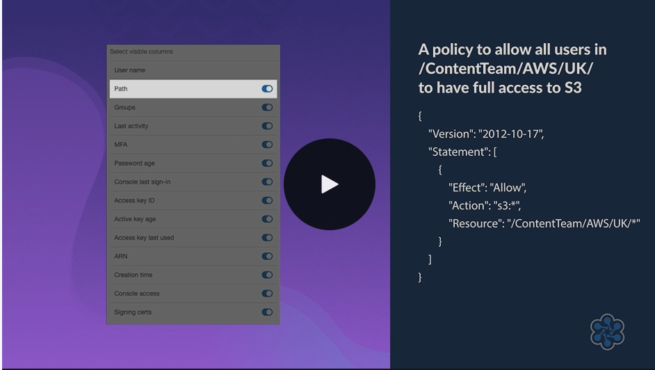
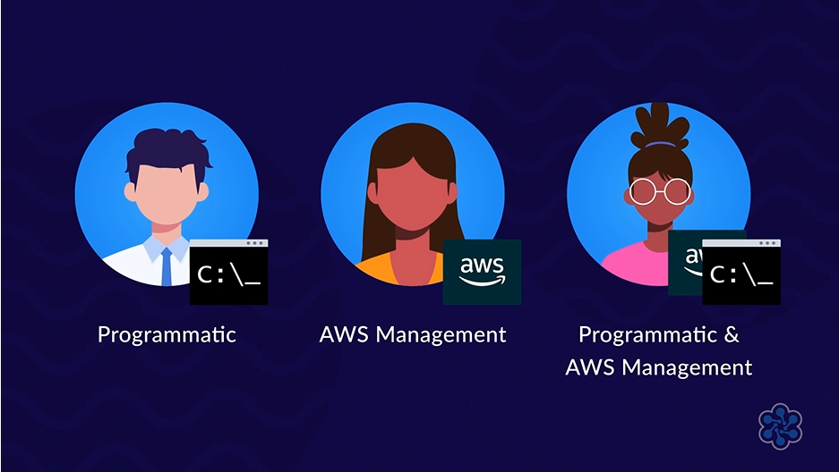

# 👤 AWS IAM Users Overview

## 🧩 Definition

**IAM Users** represent **identities with long-term credentials** that can access AWS resources.

An IAM User can represent:

- 👤 An individual person.
- ⚙️ An application that requires access to AWS resources.

The **IAM User Dashboard** provides tools for managing users while helping identify potential security risks.

---

## 🖥️ IAM User Dashboard

The **IAM User Dashboard** displays information about IAM users and their security status.

It uses **color-coded warnings** to highlight potential security risks based on user activity, making it easier to identify accounts that may require attention.
- Green tick:
    - Symbolizes that activity was measured and checked within the **last 90 days**.
- An amber exclamation:
    - Shows activity that was measured **between 91 and 365 days**.
- Red Exclamation:
    - Highlights any activity **older than 365 days**.

---

## 📋 User Dashboard Columns

### 👤 Username
Displays the user's name.

---

### 📁 Path
Organizes users within a structure.

This is especially useful for **large organizations** that need to organize users into different hierarchies.

---

### 👥 Groups
Shows the IAM User Groups that a user belongs to.

---

### 🕒 Last Activity
Displays the last time a user logged in to AWS Management Console.

This helps identify:

- 💤 Inactive accounts.
- 🔍 Users who may no longer require access.

---

### 📱 Multi-Factor Authentication (MFA)
Indicates whether a user has **Multi-Factor Authentication (MFA)** enabled for additional account security. Can be a **physical** or **virtual** device.

---

### 🔑 Password Age
Shows how long it has been since the user's password was changed.

This encourages regular password updates.

---

### 💻 Console Last Sign-In
Displays the last time the user signed in to the AWS Management Console.

---

### 🗝️ Access Key ID
Identifies the user's programmatic access keys and whether they are active or inactive.
- You are prompted to download and save Access Key IDs (will only be displayed once).
- If not saved, you will need to create a new unique secret Key ID.
- AWS does not retain copies of Secret Access Key.

---

### ⏳ Active Key Age
Displays the age of the user's access keys.

This helps determine when keys should be rotated or updated.

---

### 📊 Access Key Last Used
Shows the last time an access key was used.

Unused access keys may be candidates for removal to improve security.

---

### 🆔 ARN (Amazon Resource Name)
Provides a unique identifier for each IAM user.
- Example: **arn:awsiam:123456789012:user/Stuart**
---

### 📅 Creation Time
Displays when the IAM user was created.

---

### 🖥️ Console Access
Indicates which users have access to the AWS Management Console.
- When creating a new user you have the option to configure their access type.

---

### 📜 Signing Certificates
Shows whether a user has a signing certificate for secure access to certain AWS interfaces.

---

## 🛡️ Security Best Practices

The IAM User Dashboard helps administrators improve security by encouraging them to:

- 🗑️ Remove inactive user accounts.
- 🔑 Regularly update passwords.
- 🗝️ Rotate or remove unused access keys.
- 📱 Enable Multi-Factor Authentication (MFA) whenever possible.

---

## ✨ Features

- 👤 Manages IAM users with long-term credentials.
- 📊 Displays user activity and security information.
- 🚦 Uses color-coded warnings to identify potential security risks.
- 🔑 Tracks password and access key age.
- 📱 Displays MFA status.
- 🆔 Provides unique user identifiers through ARNs.

---

## 🎯 Use Cases

- 👥 Managing users who require long-term AWS access.
- 🔍 Monitoring user activity and account usage.
- 🛡️ Identifying inactive users that may no longer require access.
- 🔑 Managing passwords and programmatic access keys.
- 📱 Reviewing MFA adoption across users.
- 📊 Auditing user information through the IAM User Dashboard.

---

## ⚖️ Key Benefits

- 👤 Provides centralized visibility into IAM users.
- 🛡️ Helps identify potential security risks through activity monitoring.
- 🔑 Encourages regular password and access key updates.
- 💤 Makes it easier to identify inactive accounts for removal.
- 📱 Promotes stronger account security through MFA monitoring.
- 📊 Simplifies user management with detailed account information.

---

## 🧠 Analogy: IAM Users as Employee Records

Imagine the **IAM User Dashboard** as a company's **employee directory and security report**.

- 👤 Each **IAM User** is an employee.
- 📁 The **Path** is the department the employee belongs to.
- 👥 **Groups** represent teams within the company.
- 🕒 **Last Activity** shows the last day the employee came to work.
- 📱 **MFA** is like requiring an employee badge plus a PIN to enter the building.
- 🔑 **Password Age** and **Access Key Age** are reminders to replace old office keys.
- 📊 The dashboard highlights employees who haven't been active, making it easier to determine whether they still need building access.

The IAM User Dashboard helps administrators keep user accounts organized, monitored, and secure.