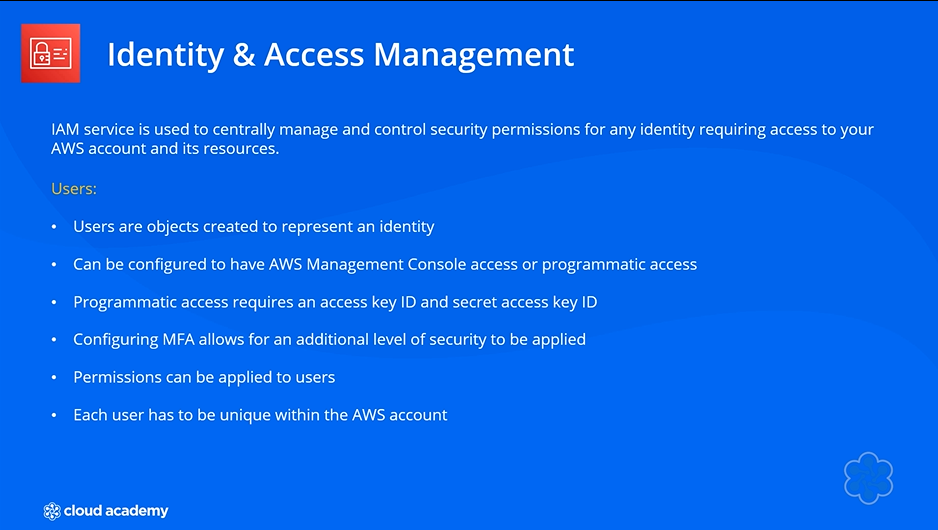
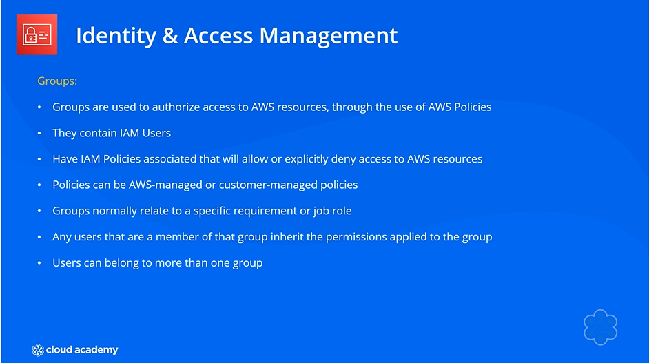
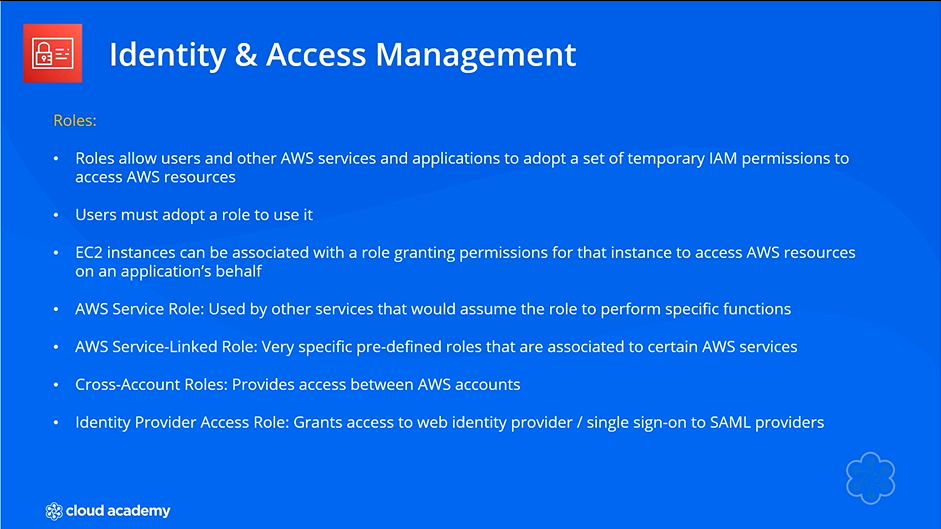
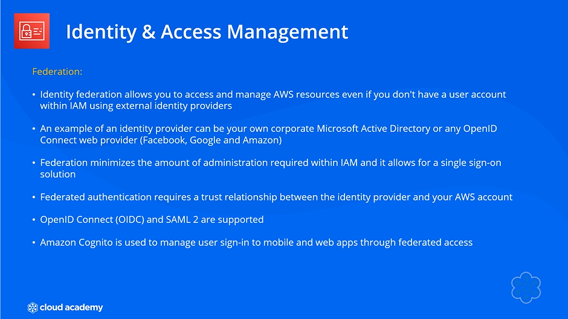
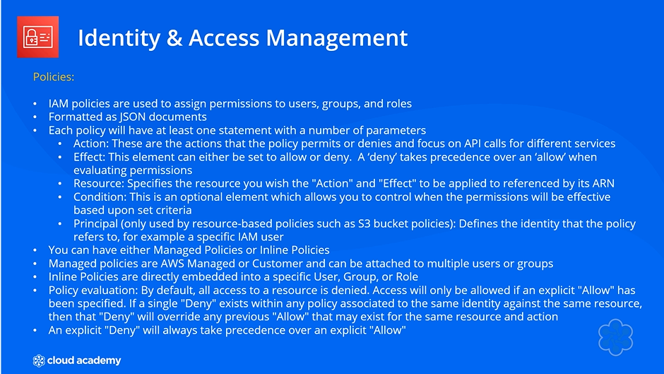
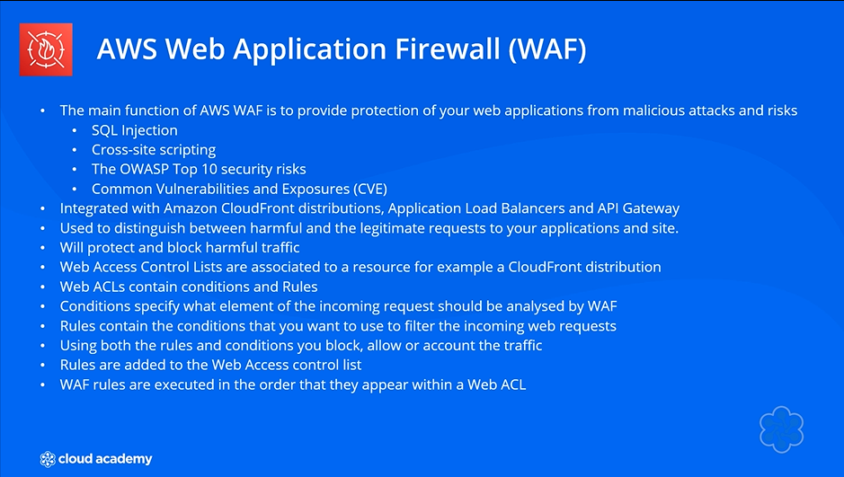
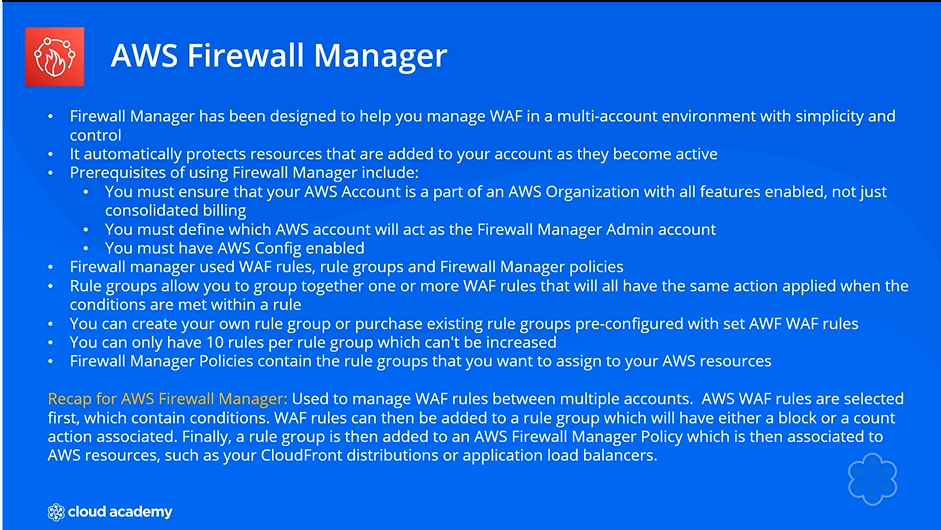
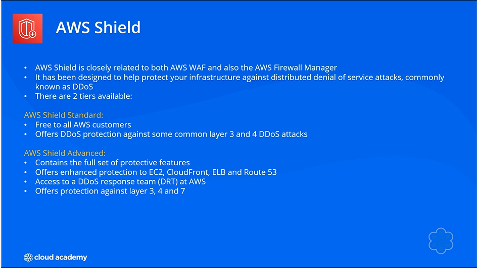
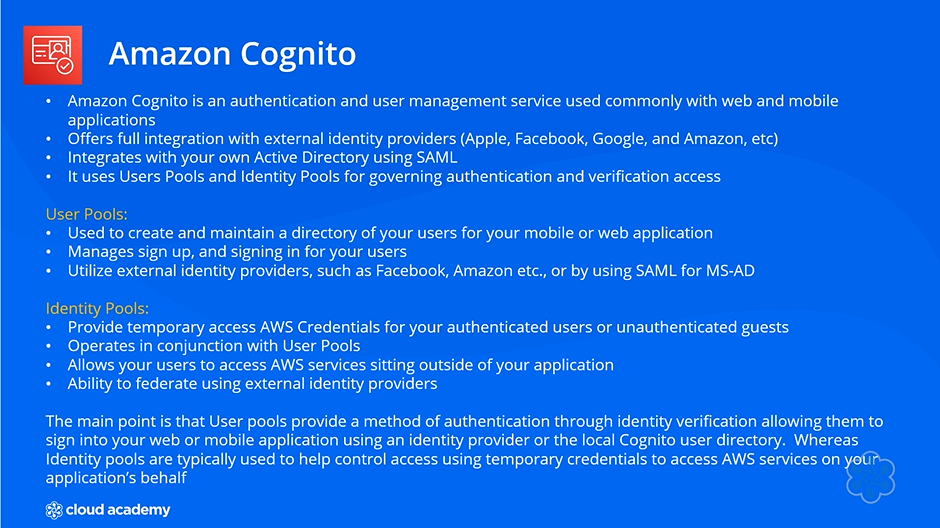

# 🛡️ AWS Security Overview

## 🧩 Definition
**AWS Security** is integrated across various AWS services, including:

- 💻 **Compute**
- 🗄️ **Storage**
- 🌐 **Networking**

Several AWS security services are especially important for **AWS SAA exam preparation**, including:

- 🔐 **IAM**
- 🛡️ **WAF**
- 🧱 **AWS Shield**
- 👤 **Amazon Cognito**

---

## 🔐 IAM — Identity and Access Management

---

## 🛡️ WAF — Web Application Firewall

---

## AWS Firewall Manager

---

## AWS Shield

---

## 👤 Amazon Cognito

---

## ⚖️ Key Takeaways
- 🛡️ AWS security is integrated across **Compute, Storage, and Networking**.
- 🔐 **IAM** manages users, groups, roles, and permissions through policies.
- 🛡️ **WAF** protects web applications by filtering requests.
- 🏢 **Firewall Manager** helps manage WAF across **multi-account environments**.
- 💥 **AWS Shield** protects against **DDoS attacks**.
- 👤 **Amazon Cognito** manages authentication and users for **web and mobile applications**.
- 📚 Understanding **IAM policies, WAF, Firewall Manager, and AWS Shield** is emphasized for **exam success**.